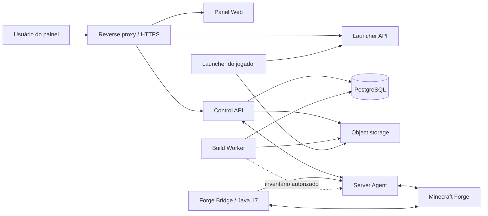
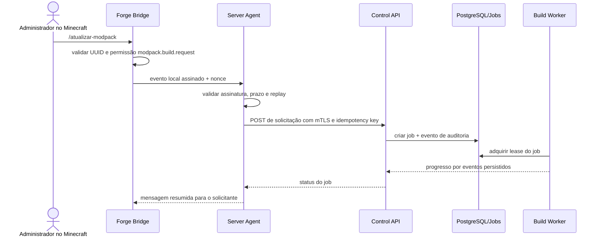
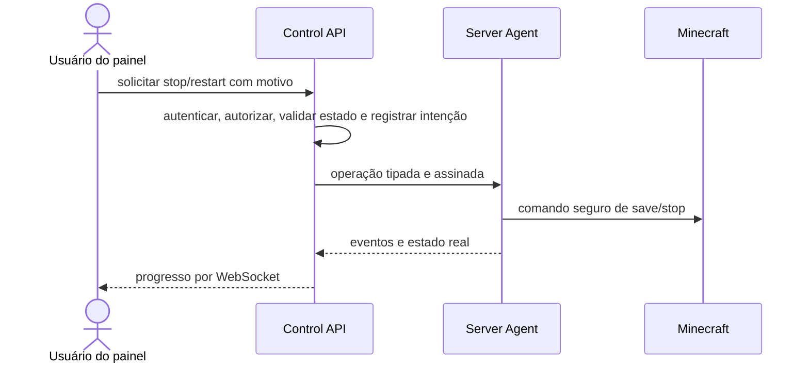

# Arquitetura

Status: Fase 2 concluída; Fase 3 iniciada somente no limite de contrato de processo. Integrações com o Minecraft permanecem bloqueadas.

## Resumo

A plataforma será um monorepo TypeScript com serviços pequenos e contratos compartilhados. Uma ponte Java 17 roda dentro do Forge apenas para permissões, telemetria e eventos do jogo. O agente próximo ao servidor controla processos e arquivos por operações tipadas; o worker monta releases em sandbox; o launcher consome apenas manifestos assinados e artefatos imutáveis.

## Componentes



| Componente | Responsabilidade | Não pode fazer |
| --- | --- | --- |
| Panel Web | UX, sessões, status, formulários e tempo real | Acessar disco ou processo Minecraft diretamente |
| Control API | autenticação, RBAC, comandos, jobs e auditoria | Executar shell ou servir arquivos privados |
| Launcher API | canais, manifestos e URLs de artefatos | Expor APIs administrativas |
| Server Agent | processo Java, console, métricas, backups e arquivos autorizados | Aceitar comando arbitrário ou publicar release sozinho |
| Forge Bridge | permissão no jogo, `/atualizar-modpack` e telemetria | Executar processo do SO ou possuir credencial administrativa ampla |
| Build Worker | classificação, staging, hashes, validação e publicação | Ler mundo, jogadores ou segredos como entrada do cliente |
| PostgreSQL | estado transacional, jobs, índices e auditoria | Guardar pacotes, mundos ou logs grandes |
| Object storage | releases, backups e logs frios | Decidir autorização ou estado de job |

## Linguagens e stack

- TypeScript estrito em `panel-web`, `control-api`, `launcher-api`, `server-agent`, `build-worker` e pacotes compartilhados.
- React/Next.js para a interface web responsiva e auto-hospedável.
- Fastify para APIs com schemas de entrada e saída.
- Java 17/Forge para a ponte no servidor.
- PostgreSQL para persistência e uma fila transacional inicial.
- WebSocket autenticado para console, progresso e métricas em tempo real.
- armazenamento local encapsulado por interface no desenvolvimento e S3 compatível em produção quando necessário.

TypeScript Project References foram adotadas para impor limites e ordem de build entre pacotes. A linha Node 24 LTS está fixada por `.nvmrc`, `engines` e Volta; npm e dependências usam versões exatas no lockfile. Fastify, PostgreSQL, autenticação/RBAC, agente, worker e a exportação estática do painel existem; Launcher API, WebSocket, object storage e Forge Bridge continuam planejados.

## Estrutura do monorepo

```text
Plataforma/
  apps/
    panel-web/
    control-api/
    launcher-api/
    server-agent/
    build-worker/
  integrations/
    forge-bridge/
  packages/
    contracts/
    database/
    authentication/
    permissions/
    minecraft-process/
    logging/
    minecraft-protocol/
    modpack-manifest/
    validation/
    configuration-schemas/
    storage/
  infra/
    containers/
    reverse-proxy/
    systemd/
    windows-service/
  tests/
    contract/
    integration/
    security/
```

Os diretórios listados que ainda não existem continuam sendo destino arquitetural, não autorização automática. A Fase 3 começou em `packages/minecraft-process/` com planos de lançamento validados e interface de adaptador, sem implementação que execute processos.

## Fluxo do comando no jogo



O comando cria um candidato. Promoção automática para `stable` somente será permitida quando catálogo, licenças, classificação e política de aprovação estiverem completos; até lá, exige aprovação no painel.

## Fluxo de controle do servidor



Forçar encerramento será uma permissão separada, com confirmação reforçada e auditoria.

## Estado e consistência

- APIs de mutação exigem `Idempotency-Key`.
- Jobs usam estados explícitos e lease renovável.
- Eventos carregam `correlationId` e sequência monotônica por job.
- Artefatos são imutáveis; somente ponteiros de canal mudam.
- Operações críticas armazenam versão anterior antes de alterar configuração.
- O painel mostra `desiredState` e `observedState` separadamente.

## Referências técnicas

- [TypeScript Project References](https://www.typescriptlang.org/docs/handbook/project-references)
- [Node.js child processes](https://nodejs.org/api/child_process.html)
- [Next.js self-hosting](https://nextjs.org/docs/app/guides/self-hosting)
- [Fastify validation and serialization](https://fastify.dev/docs/latest/Reference/Validation-and-Serialization/)
