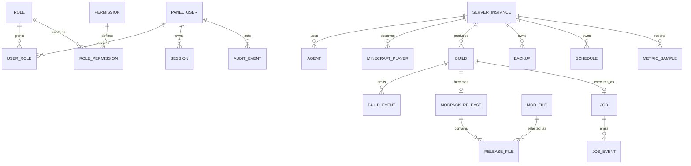

# Modelo do banco

Status: fundação da Fase 2 e encadeamento de auditoria da Fase 6 implementados; entidades persistentes de catálogo, builds, releases, jogadores, backups e métricas continuam planejadas.

## Migrações implementadas

- `0001_foundation.sql`: `panel_users`, `roles`, `permissions`, `user_roles`, `role_permissions`, `sessions`, `server_instances`, `agent_provision_tokens`, `agents`, `agent_nonces`, `jobs`, `job_events` e `audit_events`;
- `0002_rbac_seed.sql`: cinco papéis e permissões granulares com política deny-by-default;
- `0003_audit_chain.sql`: cabeças por partição, sequência e integridade da auditoria administrativa;
- `0026_ecosystem_analysis.sql`: snapshots imutáveis de análise por workspace, inventário e versão do analyzer;
- `0027_datapack_load_order_observations.sql`: observação/projeção imutáveis da ordem efetiva com FK do inventário e gate de edição fixado em `false`;
- `0028_datapack_load_order_agent_operation.sql`: allowlists do transporte e vínculo idempotente `job_id` para a captura operacional auditada;
- `0029_datapack_load_order_control_api.sql`: permissão `datapacks.observe` concedida somente a owner/administrator, separada dos grants do Server Agent e das permissões Minecraft;
- repositórios de usuários, sessões, permissões, servidores, auditoria, agentes e jobs;
- testes em PostgreSQL embarcado PGlite para migração, RBAC, idempotência, lease, conclusão `noop`, append concorrente, verificação e export de auditoria.

As seções seguintes descrevem o modelo implementado e o destino incremental. Uma entidade descrita sem migração correspondente ainda é planejamento.

## Estratégia

PostgreSQL armazena estado transacional, relações, jobs, índices de logs e auditoria. Pacotes, JARs, mundos, backups, anexos e logs extensos ficam em armazenamento de objetos/arquivos e são referenciados por ID, hash, tamanho e política de retenção.

Todas as tabelas operacionais usam `created_at` e `updated_at` em UTC. Eventos imutáveis usam apenas `occurred_at`. Migrações são versionadas e nunca alteradas depois de aplicadas.

## Visão das relações

## Identidade e acesso do painel

### `panel_users`

`id`, `email_normalized`, `display_name`, `password_hash`, `status`, `mfa_state`, `last_login_at`, timestamps.

### `sessions`

`id`, `user_id`, `token_hash`, `created_at`, `expires_at`, `last_seen_at`, `revoked_at`, `ip_prefix`, `user_agent_hash`.

Token bruto nunca é armazenado. Dados de rede possuem retenção e acesso restritos.

### `roles`, `permissions`, `user_roles`, `role_permissions`

RBAC do painel com permissões granulares. Dono não é uma flag implícita; é um papel explícito protegido por regras de último proprietário.

## Servidores e agentes

### `server_instances`

`id`, `slug`, `display_name`, `environment`, `desired_state`, `observed_state`, `minecraft_version`, `loader`, `loader_version`, `current_release_id`, `max_players`, `agent_id`, `version`.

`version` implementa concorrência otimista em configurações.

### `agents`

`id`, `server_instance_id`, `public_key`, `certificate_fingerprint`, `status`, `capabilities`, `last_seen_at`, `software_version`, `credential_rotated_at`.

Credenciais privadas ficam no cofre/host do agente, não nesta tabela.

## Jogadores e permissões do jogo

As tabelas desta seção continuam planejadas. A Fase 6 implementou snapshots e registros somente em memória; não importou nem persistiu jogador real.

### `minecraft_players`

Chave composta por `server_instance_id` e `player_uuid`; inclui nome atual, primeiro/último acesso, estado, tempo jogado e último snapshot de presença.

### `player_aliases`

`player_uuid`, `name`, `first_seen_at`, `last_seen_at`, `source`.

### `game_groups`, `game_group_memberships`, `game_permission_changes`

O grupo padrão é `player`. Alterações guardam ator, antes/depois, motivo, correlação e resultado de sincronização com o provedor de permissões do Forge.

## Catálogo e releases

### `mods`

Identidade lógica, nome, descrição, autor declarado, categoria, URL/provedor e estado de revisão.

### `mod_files`

`id`, `mod_id`, `filename`, `version`, `minecraft_version`, `loader`, `size`, `sha256`, `side`, `requirement`, `source_metadata`, `license_decision`, `reviewed_by`, `reviewed_at`.

### `mod_dependencies`

Dependência, faixa de versão, obrigatoriedade, incompatibilidade e origem da evidência.

### `builds`

`id`, `build_id`, `server_instance_id`, `requested_by_type`, `requested_by_id`, `base_release_id`, `requested_version`, `status`, `stage`, `policy_snapshot`, `started_at`, `finished_at`, `candidate_release_id`, `error_code`.

### `modpack_releases`

`id`, `version`, `build_id`, `status`, `manifest_hash`, `manifest_object_key`, `signature_key_id`, `size`, `published_at`, `previous_release_id`, `immutable`.

### `release_files`

`release_id`, `logical_file_id`, `path`, `artifact_id`, `size`, `sha256`, `kind`, `side`, `required`, `source_snapshot`.

Constraint única em `(release_id, normalized_path)`.

### `release_channels`

`name`, `release_id`, `revision`, `updated_at`, `updated_by`. Promoção exige revisão esperada para compare-and-swap.

## Jobs e eventos

### `jobs`

`id`, `type`, `resource_type`, `resource_id`, `status`, `priority`, `payload`, `idempotency_key`, `requested_by`, `available_at`, `lease_owner`, `lease_expires_at`, `attempt`, `max_attempts`, `cancel_requested_at`, `started_at`, `finished_at`, `result`, `error_code`, `correlation_id`.

### `job_events`

`job_id`, `sequence`, `stage`, `level`, `message`, `progress_current`, `progress_total`, `occurred_at`, `metadata_redacted`.

Workers adquirem jobs compatíveis em transação com lock de linha e `SKIP LOCKED`, renovam lease e usam idempotência no efeito externo. Esse desenho atende a escala inicial de uma instalação; um broker dedicado só será introduzido por novo ADR.

## Operação

### `backups`

Tipo, escopo, estado, método de consistência, object key, bytes, hash, criptografia, release associada, retenção, verificação e restauração testada.

### `schedules`

Tipo, expressão, timezone, payload validado, ativo, próxima execução, política de concorrência e criador.

### `configuration_revisions`

Recurso, schema version, conteúdo sanitizado, hash, autor, motivo, revisão anterior, aplicado em e restart requerido.

### `configuration_schemas`

Mod/recurso, versão do schema, campos, limites, unidade, path permitido e estratégia de validação. Schemas enviados por usuários nunca são executados como código.

## Observabilidade e auditoria

### `audit_events`

Append-only implementado: `id`, `occurred_at`, `correlation_id`, ator/recurso JSON validados, `source`, `action`, `outcome`, before/after/metadata redigidos, `partition_id`, `chain_sequence`, `previous_hash` e `integrity_hash`.

### `audit_chain_heads`

Uma linha por partição mantém `last_sequence`, `last_hash` e `updated_at`. `AuditRepository.append()` cria/bloqueia a cabeça em transação, calcula a integridade na camada de storage, insere o evento e avança a cabeça com revisão esperada. Produtores não podem fornecer `integrity`. Verificação e export são limitadas a 100.000 registros por operação.

### `log_indexes`

Metadados pesquisáveis e ponteiro para o conteúdo bruto: serviço, categoria, nível, fingerprint, primeira/última ocorrência, contagem, versão, mod relacionado e object key.

### `metric_samples`

Somente retenção curta ou agregada: métrica, valor, unidade, fonte, qualidade (`real`, `calculated`, `estimated`, `unavailable`) e instante de coleta. Uma solução de séries temporais pode substituir essa tabela sem mudar o contrato do painel.

## Proteções de dados

- constraints e foreign keys para invariantes;
- índices em status/lease, timestamps, UUID de jogador, hash e correlação;
- JSON apenas para payloads versionados e metadados variáveis;
- segredo fora do banco ou cifrado por envelope quando inevitável;
- auditoria com redação antes da persistência;
- sequência única por partição, cabeça bloqueada e hash pertencente ao storage;
- políticas de retenção para IP, chat, coordenadas e sessões;
- backup do banco separado do backup do mundo, ambos testados.

Referência: [PostgreSQL `SELECT`, locks e `SKIP LOCKED`](https://www.postgresql.org/docs/current/sql-select.html).
