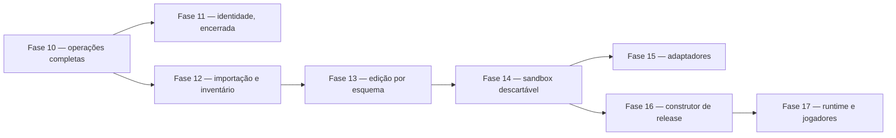

# Plano de implementação das fases finais

Status: **planejamento canônico para execução via terminal**.

Este documento transforma o estado técnico atual da VoidFall em uma sequência de implementação até um painel operacional e uma release certificável. Ele não autoriza tocar o runtime privado, publicar o canal `stable`, instalar o Forge Bridge ou executar ações reais no servidor antes dos gates indicados.

## Como usar este plano

1. Execute uma fatia por vez, na ordem apresentada.
2. Antes de editar, leia `AGENTS.md`, `Plataforma/AGENTS.md`, o documento da fase e os arquivos-alvo.
3. Não misture infraestrutura, domínio, API, painel e documentação em um único commit amplo.
4. Uma caixa marcada neste documento significa código, testes e documentação concluídos; não significa ativação em produção.
5. Nunca marque uma fase como concluída porque o pacote compila. O critério de conclusão de cada fase está descrito abaixo.
6. Preserve `Launcher/workspace/**` e `Servidor/workspace/**` como evidência imutável e ignorada.

## Linha de base

- Fases 1–6: concluídas tecnicamente em isolamento.
- Pré-Fase 7: auditoria documental concluída, com 299 componentes, 298 artefatos e 737 relações declaradas.
- Painel: export estático com fixtures; não representa telemetria real.
- Control API: autenticação, sessão, RBAC, auditoria, servidores e identidade básica do agente.
- Server Agent: registro e heartbeat outbound-only; não executa capacidades operacionais.
- Domínios de processo, backup, configuração, catálogo, release, launcher, jogadores e auditoria: testados principalmente como pacotes isolados.
- Runtime real, provider Minecraft, armazenamento externo, segredos de produção, canal `stable` e Forge Bridge instalado: não conectados.

## Definição de projeto concluído

O projeto só estará concluído quando todos estes resultados existirem simultaneamente:

- painel autenticado usando dados reais e indicando fonte, qualidade e horário;
- operações tipadas passando por Control API, job durável e Server Agent autenticado;
- catálogo de mods persistido, analisável e revisável, sem executar JAR desconhecido;
- incompatibilidades apresentadas com código, severidade, motivo e evidência;
- configuração suportada por schema, revisão, autorização, auditoria e rollback;
- processo, console, arquivos, backups, métricas e agendamentos ligados com locks duráveis;
- jogadores identificados por UUID e ações administrativas ligadas a providers aprovados;
- build reproduzível, artifacts imutáveis, manifesto assinado, promoção e rollback testados;
- launcher validando assinatura/hash e preservando arquivos não gerenciados;
- Forge Bridge empacotado, autenticado e deny-by-default;
- deploy reproduzível, TLS, PostgreSQL, object storage, segredos, monitoramento e recuperação;
- smoke tests reais de cliente, servidor, conexão, mundo novo, backup, restore e rollback;
- gates P0/P1 relevantes resolvidos e documentados.

## Visão das fases finais

Reordenado pelo [ADR-014](DECISIONS/ADR-014-objetivo-central-e-replanejamento.md) em torno do objetivo central: um painel pessoal de construção, configuração e publicação de servidores e modpacks.



| Marco | Quando acontece | Resultado |
| --- | --- | --- |
| Painel executável | já disponível | demonstração estática, sem operação real |
| Painel funcional mínimo | fim da Fase 9 | login, servidor, jobs, configurações, catálogo e incompatibilidades reais |
| **Caminho vertical completo** | fim da Fase 14 | importar, editar um valor, validar, aplicar em staging, iniciar sandbox e reverter |
| **Release publicável** | fim da Fase 16 | ZIP de servidor, modpack CurseForge, manifesto, changelog e rollback |
| Administração de jogadores | fim da Fase 17 | autenticação, claims, moderação e LuckPerms ligados |

A Fase 11 aparece **encerrada**, não concluída: ela entregou identidade, reivindicações, perfis e casos persistidos, e o resto do seu escopo foi adiado para a Fase 17.

## Gates transversais

Nenhuma fase pode contornar estes gates:

### Gate G1 — dados e privacidade

- nenhum segredo, chat, coordenada, mundo, UUID privado ou caminho local entra em Git;
- políticas de retenção e acesso existem antes de persistir dados sensíveis;
- auditoria não contém valores de configuração, senhas ou tokens.

### Gate G2 — efeitos externos

- operações aceitam IDs e payloads tipados, nunca shell livre;
- toda mutação possui ator, motivo, idempotência, autorização e evento de auditoria;
- operações destrutivas exigem preflight, backup quando aplicável e recibo final.

### Gate G3 — runtime Minecraft

- testes usam fixtures ou clone isolado até existir autorização operacional;
- start/stop/restore/configuração compartilham lock durável;
- processo órfão e PID são reconciliados após restart do agente.

### Gate G4 — distribuição

- lado, origem, licença, hash e dependências são revisados;
- nenhuma atualização é inferida como segura porque é “mais recente”;
- `stable` exige importação limpa e smoke test cliente-servidor.

### Gate G5 — qualidade

- contrato validado nos dois lados da fronteira;
- testes unitários, integração e segurança para a nova capacidade;
- `npm run check`, auditoria de runtime e matriz Windows/Linux verdes;
- documentação, roadmap e handoff atualizados.

---

## Fase 7 — configurações verificáveis

Objetivo: entregar a primeira configuração realmente operável de ponta a ponta e preparar os schemas específicos de mods sem criar um editor genérico perigoso.

### 7.0 — corrigir a base de compatibilidade usada pelo painel

- [x] separar `launcher_current`, `server_active` e cliente de referência;
- [x] respeitar `CLIENT`, `SERVER` e `BOTH` em cada dependência;
- [x] separar mod raiz de biblioteca JarJar embutida;
- [x] atribuir loader ao componente correto, sem propagar todos os loaders do JAR pai;
- [x] corrigir o baseline NeoForge, sem usar versão Forge como NeoForge;
- [x] interpretar ranges Forge/Maven usados no corpus e retornar `unknown` para formatos não suportados;
- [x] separar conflito canônico, divergência de referência e informação apenas histórica;
- [x] adicionar regressões para Armourer’s Workshop, Epic Fight, KillCam, OpenLoader, Preloading Tricks e WOM;
- [x] regenerar `docs/modpack/**` e comparar as conclusões anteriores.

A implementação deve usar fixtures públicas/sanitizadas. Uma nova leitura dos runtimes privados só pode ocorrer em tarefa forense explicitamente autorizada e separada da implementação da plataforma.

Arquivos principais:

- `tools/modpack/generate_modpack_docs.py`;
- `tools/modpack/validate_modpack_docs.py`;
- `Plataforma/packages/mod-catalog/**`;
- `Plataforma/packages/contracts/**`;
- `docs/modpack/**`.

Gate: o relatório por contexto deve ser determinístico e nunca transformar `unknown` em “compatível”.

Status: concluído em 2026-08-04. A regeneração usa somente fixtures sanitizadas versionadas; os quatro conflitos canônicos permaneceram bloqueadores, enquanto KillCam e Preloading Tricks foram reclassificados como evidência desconhecida de referência. Consulte [Validação da Fase 7.0](PHASE_7_CONTEXTUAL_COMPATIBILITY.md).

### 7.1 — registrar a decisão do primeiro schema

Decisão: usar `openloader_advanced_options_v1`, limitado a `config/openloader/advanced_options.json`. A escolha foi aprovada pelo proprietário e registrada no [ADR-008](DECISIONS/ADR-008-openloader-como-primeiro-schema.md); os packs em `data/` e `resources/` permanecem fora do editor.

- [x] criar ADR com proprietário, versão, campos permitidos e motivo da escolha;
- [x] marcar apenas o candidato aprovado como selecionado;
- [x] definir parser, serializador, limites, segredo, restart e migração;
- [x] criar fixtures públicas sanitizadas;
- [x] proibir paths e schemas fornecidos pelo usuário.

Gate: sem ADR e schema congelado, não iniciar API ou painel de edição.

Status: concluído em 2026-08-04. O schema aceita somente os dois campos booleanos `enabled`, fixa `additionalFolders` como vazio, exige restart e possui codec/fixtures determinísticos em `@voidfall/configuration-schemas`. O gate local e a [matriz Windows/Linux 30943931215](https://github.com/Myerzx/Void-Modpack/actions/runs/30943931215) passaram. A persistência e a aplicação isolada foram concluídas na Fase 7.2; integração operacional continua bloqueada até a Fase 7.3.

### 7.2 — persistência e operação de configuração

- [x] criar migração para schemas, recursos, revisões e estado de aplicação;
- [x] implementar repositórios PostgreSQL e concorrência otimista;
- [x] ligar `configuration-schemas` ao `server-configuration` por registro confiável;
- [x] correlacionar revisão preparada, aplicação, falha e rollback;
- [x] integrar lock operacional compartilhado;
- [x] registrar ator, motivo e auditoria sem valores sensíveis.

Status: concluído tecnicamente em isolamento em 2026-08-04. O registro de produto aceita somente o codec OpenLoader revisado; a migration `0004_configuration_operations.sql` persiste schemas, recursos, revisões, estado e lock compartilhado; e `PersistentConfigurationService` correlaciona PostgreSQL, filesystem temporário, falha e rollback sem persistir valores. O gate local e a [matriz Windows/Linux 30952093047](https://github.com/Myerzx/Void-Modpack/actions/runs/30952093047) passaram. Consulte [Persistência e operação da Fase 7.2](PHASE_7_CONFIGURATION_PERSISTENCE.md). API, agente e painel permanecem fora deste recorte.

### 7.3 — API, agente e painel

- [x] `GET` de schemas e recursos autorizados;
- [x] `GET` de valores redigidos e revisões;
- [x] `POST` de validação sem aplicação;
- [x] `POST` de aplicação com hash esperado e chave de idempotência;
- [x] `POST` de rollback para revisão elegível;
- [x] operação tipada no Server Agent;
- [x] página de configuração com diff seguro, restart visível e estados de erro;
- [x] teste E2E contra diretório temporário, nunca runtime privado.

Critério de conclusão da Fase 7:

- [x] uma configuração suportada percorre painel → API → job/agente → filesystem isolado → auditoria;
- [x] validação, concorrência, falha e rollback estão testados;
- [x] nenhum formato não registrado pode ser editado.

Status: concluída tecnicamente em isolamento em 2026-08-04. Os contratos v1 fixam identificadores e valores escalares revisados sem payload extensível; a migration `0005_configuration_permissions.sql` mantém as quatro permissões deny-by-default; a capability `configuration.apply` resolve raiz, path, schema e codec somente por configuração confiável local; e o painel expõe diff seguro com restart apenas como metadata. O gate local e a [matriz Windows/Linux 30958519999](https://github.com/Myerzx/Void-Modpack/actions/runs/30958519999) passaram. Consulte [API, agente e painel da Fase 7.3](PHASE_7_CONFIGURATION_API.md).

Commits sugeridos:

- `fix(modpack-audit): evaluate compatibility by runtime context`;
- `docs(decision): select first configuration schema`;
- `feat(configuration): persist reviewed schemas and revisions`;
- `feat(control-api): expose audited configuration operations`;
- `feat(panel): add typed configuration workflow`.

---

## Fase 8 — entrada adaptativa de mods e incompatibilidades

Objetivo: permitir adicionar um artefato para análise, registrar incompatibilidades e explicar o motivo, sem instalar ou corrigir automaticamente.

### 8.1 — inspeção segura de artefato

- [x] criar `packages/artifact-inspection` ou responsabilidade equivalente isolada;
- [x] ler ZIP central directory, `mods.toml`, `neoforge.mods.toml`, `fabric.mod.json`, manifesto e JarJar;
- [x] limitar tamanho expandido, quantidade de entradas, profundidade e nomes;
- [x] rejeitar path traversal, ZIP bomb, arquivo truncado e metadata excessiva;
- [x] nunca carregar classe, executar JAR ou deserializar objeto arbitrário;
- [x] emitir relatório versionado com hash e evidências.

Status: concluída tecnicamente em isolamento em 2026-08-04. `@voidfall/artifact-inspection` lê somente o conjunto fechado de descritores revisados e infla apenas eles; o único decodificador é DEFLATE bruto do `node:zlib`, nenhum JAR aninhado é aberto e nada é escrito em disco. Uma versão declarada como `${file.jarVersion}` só é resolvida pelo manifesto que a declara e, caso contrário, permanece literal. Um descritor presente mas ilegível dentro do subconjunto estrito vira issue registrada, nunca omissão. As fixtures são construídas em código por um escritor ZIP determinístico, de modo que cada campo corrompido por um teste permanece revisável no diff. O gate local e a [matriz Windows/Linux 30961224930](https://github.com/Myerzx/Void-Modpack/actions/runs/30961224930) passaram. Consulte [Inspeção segura de artefato da Fase 8.1](PHASE_8_ARTIFACT_INSPECTION.md).

### 8.2 — motor de compatibilidade

- [x] comparar Minecraft, loader, loader version, lado e dependências por contexto;
- [x] resolver ranges suportados e manter os demais como `unknown` bloqueante;
- [x] detectar IDs, hashes e filenames duplicados;
- [x] detectar dependência obrigatória ausente, ciclo e conflito explícito;
- [x] classificar issue como `blocker`, `warning` ou `information`;
- [x] manter códigos estáveis e mensagem humana separada;
- [x] produzir explicação, evidência e ação manual recomendada, sem inventar correção.

Códigos mínimos:

- `minecraft-version-mismatch`;
- `loader-mismatch`;
- `loader-version-mismatch`;
- `side-mismatch`;
- `missing-required-dependency`;
- `dependency-version-mismatch`;
- `duplicate-mod-id`;
- `duplicate-content`;
- `filename-collision`;
- `explicit-conflict`;
- `metadata-unverified`;
- `distribution-unreviewed`.

Status: concluída tecnicamente em isolamento em 2026-08-05. `@voidfall/artifact-compatibility` julga as declarações da Fase 8.1 contra um ou mais contextos alvo e separa dois eixos: `code` nomeia o assunto e é estável, `determinacy` diz se aquilo foi provado ou apenas não pôde ser descartado. O contrato recusa qualquer issue `unproven` que não bloqueie, então desconhecido bloqueia sem virar defeito provado. Além dos doze códigos mínimos, `dependency-cycle` cobre mods que se exigem mutuamente. Lado e conflito explícito vêm de revisão humana, nunca de presença ou filename; uma dependência obrigatória ausente vira `possibly-embedded` e não provada quando o artefato declara bibliotecas JarJar que nunca foram abertas; e o avaliador de ranges Maven da Fase 7.0 é reutilizado em vez de reimplementado. O `detail` é sanitizado pelo motor contra um charset sem separador de caminho nem prefixo de unidade. O gate local e a [matriz Windows/Linux 30974767140](https://github.com/Myerzx/Void-Modpack/actions/runs/30974767140) passaram. Consulte [Motor de compatibilidade da Fase 8.2](PHASE_8_COMPATIBILITY_ENGINE.md).

### 8.3 — persistência, API e revisão

- [x] persistir upload, quarentena, inspeção, issues e decisão humana;
- [x] endpoint streaming autenticado com limite e rate limit;
- [x] jobs duráveis para inspeção e análise;
- [x] estados `uploaded`, `quarantined`, `analyzing`, `blocked`, `reviewable`, `approved`, `rejected`;
- [x] aprovação não instala o mod; apenas altera o estado de revisão;
- [x] toda decisão registra ator, motivo e hash analisado.

Status: concluída tecnicamente em isolamento em 2026-08-05. A migration `0006_artifact_review.sql` guarda submissões, os dois relatórios, as issues como linhas e um log append-only de decisões; a máquina de estados é validada no contrato, no repositório e nas CHECKs do banco. Uma decisão nomeia o hash analisado e a versão lida, então uma decisão sobre análise obsoleta é recusada em vez de aplicada, e `blocked` só sai por rejeição explícita. O upload é streaming, recusa pelo `content-length` antes de ler um byte e depende de uma quarentena injetada — sem ela responde `503`. Os jobs `artifact.inspect` e `artifact.analyze` reutilizam a fila `SKIP LOCKED` e carregam apenas referência opaca. Nenhuma permissão nova foi criada: `mods.view`/`mods.manage`/`mods.classify` já eram menor privilégio. O gate local e a [matriz Windows/Linux 30977108776](https://github.com/Myerzx/Void-Modpack/actions/runs/30977108776) passaram. Consulte [Persistência, API e painel das Fases 8.3 e 8.4](PHASE_8_ARTIFACT_REVIEW.md).

### 8.4 — experiência do painel

- [x] lista compacta de mods com busca, lado, versão e estado;
- [x] upload com progresso e estado de quarentena;
- [x] janela/drawer de incompatibilidade com severidade, motivo e evidência;
- [x] filtro por blocker/warning/information;
- [x] grafo de dependências sob demanda;
- [x] botão de instalação ausente ou desabilitado nesta fase;
- [x] fixture de erro substituída por dados reais da API quando disponível.

Status: concluída tecnicamente em isolamento em 2026-08-05. O view model é puro e testável sem navegador: a busca cobre arquivo, mod id e prefixo de hash; o progresso descreve somente bytes enviados, porque quarentena e análise são passos duráveis à parte; o grafo é derivado sob demanda do que o artefato declara, sem abrir JAR aninhado. Um lado que ninguém revisou aparece como não revisado, e um bloqueio apenas não comprovado é apresentado como tal. `buildInstallActionView()` devolve `present: false` por construção, de modo que nenhuma tela consegue renderizar um botão de instalação habilitado.

Critério de conclusão da Fase 8:

- um JAR de teste entra em quarentena, é inspecionado sem execução e gera relatório persistido;
- qualquer incompatibilidade mínima aparece no painel e fica auditada;
- nenhum artefato analisado alcança o runtime Minecraft.

Commits sugeridos:

- `feat(artifact-inspection): parse bounded loader metadata`;
- `feat(mod-catalog): report contextual compatibility issues`;
- `feat(database): persist artifact analysis workflow`;
- `feat(control-api): add quarantined mod analysis endpoints`;
- `feat(panel): show mod compatibility findings`.

---

## Fase 9 — núcleo operacional e painel funcional mínimo

Objetivo: conectar os domínios já testados à aplicação real sem liberar todas as ações perigosas de uma vez.

### 9.1 — contratos operacionais e persistência

- [x] persistir comandos, idempotência, locks, PID observado e recibos;
- [x] persistir catálogos, configurações, análises e jobs atualmente em memória;
- [x] criar paginação, filtros e limites para endpoints administrativos;
- [x] correlacionar job, operação do agente e evento de auditoria;
- [x] adicionar outbox/eventos sem dual write.

Status: concluída tecnicamente em isolamento em 2026-08-05. A migration `0007_operational_core.sql` guarda operações com recibo, estado observado do processo, o outbox e o catálogo revisado. Três propriedades passam a sobreviver a um restart: a idempotência, por chave única mais fingerprint dos campos estáveis do pedido; a exclusão mútua, por índice único parcial que permite no máximo uma operação em voo por servidor; e o PID observado, sempre acompanhado do `boot_id` que o identifica. O evento de outbox é escrito na mesma transação da mudança de estado, e a entrega é marcada depois de acontecer, logo a garantia é at-least-once. Um `correlationId` atravessa operação, job e auditoria, e `GET /api/v1/correlations/:correlationId` devolve os três juntos. Toda listagem administrativa é limitada na rota e novamente no repositório, e um limite acima do máximo é recusado em vez de reduzido em silêncio. O gate local e a [matriz Windows/Linux 30989284065](https://github.com/Myerzx/Void-Modpack/actions/runs/30989284065) passaram. Consulte [Núcleo operacional da Fase 9.1](PHASE_9_OPERATIONAL_CORE.md).

### 9.2 — transporte real Control API ↔ Server Agent

- [x] mTLS ou transporte autenticado aprovado;
- [x] rotação/revogação de identidade do agente;
- [x] protocolo outbound-only com lease e replay protection;
- [x] supervisor do agente e reconciliação após restart;
- [x] capacidades anunciadas e autorizadas individualmente;
- [x] nenhuma operação genérica ou payload extensível executável.

Status: concluída tecnicamente em isolamento em 2026-08-05. A migration `0008_agent_transport.sql` acrescenta histórico de credenciais, concessões de capacidade e leases de trabalho. A rotação substitui em vez de editar, então um fingerprint superado nunca mais autentica; a revogação retira credencial e concessões juntas. Uma capacidade anunciada não autoriza nada — só a concessão autoriza, e o claim confere também os tipos de job que aquela capacidade pode servir. `claimWork` reserva o job e grava o lease na mesma transação, e `reclaimExpiredLeases` devolve à fila enquanto houver tentativa ou falha de vez quando o orçamento acabou, sem nunca deixar job preso em `running`. O supervisor espera o intervalo que o plano de controle pede, recua geometricamente até um teto em falha e encerra limpo. Consulte [Transporte do agente da Fase 9.2](PHASE_9_AGENT_TRANSPORT.md).

### 9.3 — painel dinâmico

- [x] login/logout/sessão consumindo Control API;
- [x] seletor de instância real;
- [x] dashboard com fonte, qualidade e timestamp;
- [x] páginas de servidor, jobs, mods, configurações e auditoria;
- [x] estados loading, vazio, indisponível, negado e erro;
- [x] esconder ações sem permissão;
- [x] manter mutações perigosas desabilitadas até a fase correspondente.

Status: concluída tecnicamente em isolamento em 2026-08-05. O shell expressa três regras uma vez só: a tela declara em qual estado está e só renderiza conteúdo quando pronta, uma recusa nunca vira erro, e uma ação sem permissão não é renderizada em vez de aparecer desabilitada. Permissão e disponibilidade são separadas: iniciar, parar e reiniciar servidor, comando de console, backup e instalação de artefato continuam desabilitados mesmo para `owner`, nomeando a fase que os implementa. Todo tile carrega origem, qualidade e horário; um processo que ninguém observou é reportado como desconhecido e não como desligado, e as áreas que seguem fixture são nomeadas dentro da própria view. Consulte [Painel dinâmico da Fase 9.3](PHASE_9_DYNAMIC_PANEL.md).

Critério de conclusão da Fase 9:

- painel deixa de depender de fixtures para as áreas implementadas;
- API e agente trocam comandos inofensivos e estados reais em ambiente de integração;
- reinício de API/agent não perde idempotência nem cria operação duplicada.

---

## Fase 10 — operações completas do servidor

Objetivo: tornar processo, console, arquivos, backups, métricas, logs e agendamentos operáveis com segurança.

### 10.1 — processo e console

- [x] lock durável compartilhado e reconciliação de PID/processo órfão;
- [x] start, stop e restart com timeout, estado observado e recuperação;
- [x] cursor de console, limitação, redação e retenção;
- [x] comandos continuam em catálogo fechado;
- [x] force kill permanece em fluxo separado e altamente restrito.

Status: concluída tecnicamente em isolamento em 2026-08-05. A capability `process.control` toma o `minecraft-exclusive` — o mesmo lock que a configuração já usava e que nenhuma operação de processo consumia —, então um start não corre mais contra um apply. Cada ação carrega a própria permissão, e a operação é aceita antes de existir job, de modo que uma segunda requisição é recusada antes de haver o que executar duas vezes. Force kill tem rota, permissão, tipo de operação, tipo de job e capability próprios, exige a parada graciosa que sucede e que ela tenha de fato falhado, e exige reconhecimento explícito de perda de dados sem valor padrão. O console é append-only por sequência, com cursor que sobrevive à retenção, redação na entrada e poda na mesma transação do append. Consulte [Processo e console da Fase 10.1](PHASE_10_PROCESS_CONSOLE.md).

### 10.2 — arquivos e configurações

- [x] descoberta somente em raízes autorizadas;
- [x] criar, renomear, mover, copiar e excluir com revisão e política;
- [x] upload/download limitados e sem execução;
- [x] proteção contra junction, symlink e alias cross-platform;
- [x] diff e restauração de texto sem revelar segredos.

Status: concluída tecnicamente em isolamento em 2026-08-05. Toda mutação obedece a três regras: nada é sobrescrito, o que se perde é preservado como revisão imutável antes da perda, e a mutação fica dentro de uma raiz. Renomear é o caso do move em que origem e destino compartilham o pai, não uma operação separada. O contrato recusa barra invertida e dois-pontos de saída, o que torna `C:\...`, prefixo UNC e fluxo alternativo NTFS inexprimíveis em qualquer plataforma, e recusa nomes que resolvem para arquivo diferente do que se lê (ponto ou espaço final, dispositivo reservado, não-NFC). O diff casa linhas cruas e redige na saída, de modo que uma troca de credencial aparece como mudança sem que nenhum dos dois valores apareça. A restauração só preenche caminho ausente e nunca devolve os bytes preservados ao chamador. Nenhuma raiz real foi configurada. Consulte [Arquivos autorizados da Fase 10.2](PHASE_10_AUTHORIZED_FILES.md).

### 10.3 — backups e restore

- [x] backend local/objeto escolhido;
- [x] quotas, retenção, criptografia e integridade autenticada;
- [x] backup offline ou protocolo online confirmado pelo Forge Bridge;
- [x] restore com preflight, parada, lock, troca atômica e boot de verificação;
- [x] ensaio de disaster recovery documentado.

Status: concluída tecnicamente em isolamento em 2026-08-05. O backend é o repositório local no host do agente; o de objeto não foi ligado porque exigiria credencial e endpoint atravessando o plano de controle. A integridade passou a ser autenticada: um manifesto de SHA-256 atesta a si mesmo, e quem escreve no repositório reescreve payload e digest juntos — o selo HMAC sob chave que nunca vive lá é o que recusa essa reescrita, e há teste que a executa. A criptografia é AES-256-GCM por arquivo, com o manifesto guardando o digest do texto claro para que a verificação prove que o backup ainda restaura para os mesmos bytes. A quota é conferida antes da cópia e a retenção nunca libera o backup mais novo nem propõe esvaziar o repositório. Restore exige reconhecimento explícito de perda de dados, a parada precedente tendo de fato concluído, e um backup medido e selado; a troca é atômica em pai isolado e o boot de verificação exige observar `online`. O ensaio de disaster recovery roda como teste e cobre também perda de chave, adulteração e destino ocupado. Consulte [Backups e restore da Fase 10.3](PHASE_10_BACKUP_RESTORE.md).

### 10.4 — métricas, logs e alertas

- [x] coleta autenticada de host, processo e JVM;
- [x] TPS/MSPT via provider aprovado;
- [x] armazenamento agregado com retenção;
- [x] logs estruturados, agrupamento de erro e correlação;
- [x] alertas de disco, memória, crash, agente offline e job falho;
- [x] cada valor mostra fonte e qualidade.

Status: concluída tecnicamente em isolamento em 2026-08-05. Toda leitura carrega um valor **ou** um motivo para não ter um, nunca um padrão fazendo as vezes de valor. TPS e MSPT exigem um provider aprovado no jogo, que depende do Forge Bridge e permanece desligado: eles voltam como indisponíveis com motivo, e tanto o contrato quanto uma constraint de tabela recusam qualquer outra fonte alegando tê-los medido — nenhum bug de coletor consegue colocar um número inventado num gráfico. Qualidade não tira média: um bucket vale o que vale seu pior insumo, e leituras sem valor são descartadas em vez de contadas como zero. Uma leitura indisponível nunca fecha um alerta, porque um coletor parado é indistinguível de um disco que parou de encher. Consulte [Métricas, logs e agendamentos das Fases 10.4 e 10.5](PHASE_10_TELEMETRY_SCHEDULES.md).

### 10.5 — agendamentos

- [x] agenda persistente com timezone explícito;
- [x] avisos, backup, manutenção e restart como passos tipados;
- [x] lease, deduplicação, cancelamento e recuperação após crash;
- [x] verificação pós-restart antes de concluir.

Status: concluída tecnicamente em isolamento em 2026-08-05. Um agendamento é plano tipado de catálogo fechado, nunca script; a ordem dos passos é validada, porque um backup depois do restart capturaria o mundo que o restart produziu. O fuso é obrigatório e o cálculo caminha dia a dia no fuso alvo em vez de somar blocos de 24 horas — uma transição de horário de verão deslocaria a janela e a manteria deslocada. Uma hora que não existe vai para o primeiro instante que existe, e uma hora que acontece duas vezes vale na primeira. Uma execução pertence a uma ocorrência, e o índice único sobre `(schedule_id, scheduled_for)` faz a deduplicação ser trabalho do banco: dois agendadores acordando juntos não podem ambos achar que ganharam. Reivindicações expiram, então um agendador que morre libera a sua por decurso. Ocorrências perdidas são reportadas, nunca executadas. Uma execução que reiniciou só reporta sucesso se viu o servidor voltar. Consulte [Métricas, logs e agendamentos das Fases 10.4 e 10.5](PHASE_10_TELEMETRY_SCHEDULES.md).

Critério de conclusão da Fase 10:

- todas as operações passam por RBAC, job, agente, lock, auditoria e recibo;
- backup e restore completam um ensaio em ambiente isolado;
- o painel não apresenta métrica simulada como real.

---

## Fase 11 — jogadores, permissões e moderação reais

### 11.0 — gate de entrada operacional

- [x] auditoria de saída da Fase 10 confirmada contra o código;
- [x] capabilities registradas no runtime por injeção explícita;
- [x] validação de configuração no startup, com ausente e malformado tratados diferente;
- [x] readiness por capability, com motivo quando indisponível;
- [x] raízes autorizadas e repositório de backup em diretórios temporários, chaves fora do Git;
- [x] coletores básicos ligados, com TPS/MSPT indisponíveis;
- [x] loop do agendador com lease, deduplicação, recuperação e encerramento limpo;
- [x] reconciliação de PID órfão com dono no startup e periódica.

Status: concluído em 2026-08-05. A auditoria encontrou uma afirmação errada da Fase 10.1: `process.force-kill` tinha nome de capability no contrato mas **nenhum handler no agente** — não era falta de instanciação, era falta de implementação. Corrigido no documento e distinguido na readiness como `deliberately-disabled`. Uma capability só é anunciada quando todas as suas dependências existem, e o mapa de handlers é derivado da readiness em vez de montado ao lado dela, porque o supervisor reivindica exatamente o que anuncia. Consulte o [gate de entrada operacional](PHASE_11_OPERATIONAL_ENTRY_GATE.md).


Objetivo: conectar o domínio puro da Fase 6 a providers aprovados e às telas operacionais.

- [x] decidir autenticação Minecraft e provider de permissões em ADRs — [ADR-009](DECISIONS/ADR-009-autenticacao-minecraft-e-topologia.md), [ADR-010](DECISIONS/ADR-010-provider-de-permissoes-minecraft.md) e [ADR-011](DECISIONS/ADR-011-dados-de-jogador-e-retencao.md) aceitos em 2026-08-06. `online-mode` permanece `false` porque o servidor aceita jogadores sem conta oficial, com camada de autenticação obrigatória e reivindicação de identidade; LuckPerms é o provider e a fonte de verdade, com o VoidFall enviando operações duráveis e não mantendo segunda fonte editável; dados de jogador ficam no núcleo mínimo. Duas pendências registradas bloqueiam os itens abaixo: **onde mora a credencial de autenticação** e **por qual caminho uma operação chega ao LuckPerms**;
- [ ] persistir perfis, aliases, bindings, casos e recibos — identidade, reivindicações e aliases persistidos em 2026-08-06 pela migração `0015_player_identity.sql`, com contrato `PlayerIdentity`/`MinecraftClaim` e `PlayerIdentityRepository`; **casos de moderação e recibos continuam pendentes**, e dependem de resolver a tensão de chave descrita abaixo. Grupos e nós não são persistidos, por decisão do [ADR-010](DECISIONS/ADR-010-provider-de-permissoes-minecraft.md);
- [ ] implementar importação/reconciliação por UUID sem confiar em nome — reinterpretado pelo [ADR-009](DECISIONS/ADR-009-autenticacao-minecraft-e-topologia.md) como reconciliação pela reivindicação. `importLegacyClaim` traz uma conta anterior como registro que não concede nada, e `proveLegacyClaim` é a reivindicação que os 7 operadores precisam fazer;
- [ ] ligar provider Forge deny-by-default — núcleo do Bridge implementado em 2026-08-06 conforme [ADR-013](DECISIONS/ADR-013-permissoes-tipadas-no-forge-bridge.md): contrato tipado das quatro operações, `PermissionCommandService` com resolução de reivindicação, releitura pós-mutação, rebind transacional e readiness com motivo nomeado; falta a ligação concreta à API do LuckPerms na camada de mod, o job durável e a capability do agente;
- [ ] ligar executor tipado de kick, ban, mute, whitelist e grupo — grupo e nó cobertos pelas quatro operações iniciais; kick, ban, mute e whitelist continuam fora do conjunto por decisão do ADR-013;
- [ ] exigir motivo e autorização por ação — **adiado**;
- [ ] definir política de chat, coordenadas e atividade antes da coleta — decidido pelo [ADR-011](DECISIONS/ADR-011-dados-de-jogador-e-retencao.md): fora do escopo até haver finalidade nomeada;
- [ ] criar API paginada e telas de perfil, histórico e moderação — **adiado**;
- [ ] auditar leitura de dados sensíveis e aplicar retenção — **adiado**;
- [ ] testar expiração, concorrência e falha do provider — **adiado**.

### Encerramento da Fase 11

O [ADR-014](DECISIONS/ADR-014-objetivo-central-e-replanejamento.md) esclareceu o objetivo central do produto: o VoidFall é um **painel pessoal de construção, configuração e publicação** de servidores e modpacks. Gestão de jogadores não está no caminho principal, e nada dos sete passos desse caminho precisa de autenticação, claims, moderação ou LuckPerms.

A fase é encerrada em 2026-08-06 com o que está íntegro e testado:

- identidade estável, reivindicações com revisão, aliases, perfis e casos de moderação persistidos, chaveados pela identidade;
- contrato tipado das quatro operações de permissão, `ClaimEvidence` e `ClaimInvalidation`;
- núcleo do Forge Bridge para permissões, com resolução de reivindicação, releitura pós-mutação e rebind transacional.

Os itens marcados **adiado** — e a implementação restante dos ADRs 009, 010, 012 e 013 — passam para a Fase 17. Os ADRs permanecem aceitos: adiar não é revogar, e cada um continua sendo a decisão vigente para quando esse trabalho começar.

---

## Fases 12–17 — replanejadas em torno do caminho principal

O [ADR-014](DECISIONS/ADR-014-objetivo-central-e-replanejamento.md) reordena o que vem depois. As fases abaixo substituem o antigo par 12–13, que continua registrado adiante como referência do que já estava planejado para release e produção.

### Fase 12 — importação e inventário

Objetivo: ler um servidor ou modpack e saber exatamente o que existe nele.

- [x] importar um workspace a partir de um **diretório**, sem tocar na origem — `@voidfall/workspace-inventory`, 2026-08-06. Import de **pacote** continua pendente: é o import de diretório com um passo de descompactação na frente;
- [x] analisador estático de JAR: mod id, versão, dependências, lado, loader — composto com `@voidfall/artifact-inspection`, que já lê metadados declarados sem carregar classe nem executar nada;
- [x] descoberta de arquivos de configuração TOML, JSON e properties;
- [x] descoberta de datapacks, scripts e recursos, por raiz e extensão;
- [x] classificar cada mod em `FULLY_MANAGED`, `STRUCTURED`, `RAW_EDITABLE`, `UNSUPPORTED` ou `RUNTIME_ONLY`;
- [x] inventário reproduzível, com hash por arquivo e digest do próprio inventário.

Decisões de recorte tomadas na implementação:

- **estado privado é recusado e nomeado**, não pulado: mundo, logs, crash reports, `server.properties`, `ops.json`, `whitelist.json`, caches. Um inventário que os omitisse em silêncio seria indistinguível de um que falhou em olhar;
- **symlink não é seguido.** Um link dentro de um pack importado aponta para qualquer lugar do host, e um scanner que o seguisse poderia ser levado a hashear arquivos fora da árvore;
- **nada de timestamp entra no digest.** É o que faz duas varreduras da mesma árvore compararem iguais, e é o que dá sentido a um diff entre versões;
- **mod id casa exato, nunca por prefixo.** `jei` não reivindica a configuração de `jeitweaker`;
- **revisado é um upgrade sobre uma correspondência, nunca uma correspondência.** Um defeito encontrado pelo próprio teste: casar só por ser revisado atribuiria o recurso de um mod a todos os outros, e o `FULLY_MANAGED` resultante seria a afirmação de que alguém entendeu campos que nunca viu;
- **`RUNTIME_ONLY` é a resposta quando nada é encontrado**, não `UNSUPPORTED`. A maioria dos mods Forge escreve sua configuração no primeiro boot, então a resposta honesta nomeia o que resolveria — que é exatamente o que a sandbox da Fase 14 faz.

`UNSUPPORTED` é resultado legítimo e frequente. Um inventário que classifica tudo como editável está mentindo sobre o que sabe.

### Fase 13 — edição segura por esquema inferido

Objetivo: alterar configuração sem entender semântica que ninguém revisou.

- [x] inferir esquema de um arquivo estruturado e gerar formulário — `@voidfall/configuration-inference`, 2026-08-07. TOML e JSON;
- [x] editar valor com validação de tipo e limite — `validateProposedValue`, que distingue **verificado contra limite declarado** de **aceito só por tipo**;
- [x] aplicar em staging, nunca no workspace ativo — `@voidfall/configuration-staging`, 2026-08-07;
- [x] diff legível e rollback por revisão — diff por linha, e descarte antes do apply é apagar um arquivo que este serviço escreveu;
- [ ] modo avançado para `RAW_EDITABLE`, com aviso explícito.

A distinção que sustenta a fase: **estrutura se infere, significado não.** Um valor `true` é um booleano — isso é fato sobre o arquivo. O que o campo faz e se mudá-lo é seguro não estão no arquivo e não são adivinhados.

Há uma exceção que não é exceção: o `ForgeConfigSpec` escreve os próprios limites no arquivo como comentários — `#Range: 0 ~ 100`, `#Allowed Values: EASY, NORMAL`. Ler isso é ler uma **declaração**. Por isso todo limite carrega de onde veio, e um campo sem limite declarado é validado só por tipo, com a resposta dizendo isso — alegar o contrário esconderia que ninguém sabe o que aquele campo aceita.

Um limite que não foi entendido é descartado em vez de aproximado: um limite mal lido recusa valores que o mod aceita ou aceita valores que ele não aceita, e os dois parecem o editor funcionando. A linha continua visível na documentação do campo, verbatim.

O staging não re-serializa o documento. Cada campo lembra a linha de onde veio, então alterar um valor **substitui o valor daquela linha** e todo o resto do arquivo sobrevive byte a byte — comentários, indentação, e tudo o que o leitor recusou representar. Re-serializar a partir do formulário só poderia escrever de volta o que o formulário tem, e qualquer construção não representada sumiria de um arquivo em que a pessoa achava que tinha mudado um valor.

Cada mudança guarda o digest do arquivo contra o qual foi calculada. Aplicar depois verifica que ele ainda é esse — sem isso, uma edição feita no meio-tempo (por uma mão, por um mod regenerando sua config, por um restore) seria sobrescrita por uma mudança que nunca a viu.

**Aplicar não está neste pacote.** É o único passo destrutivo, pertence atrás da própria autorização, e colocá-lo no mesmo objeto das operações seguras é como ele acaba sendo chamado por acidente.

Para JSON não há linha para editar cirurgicamente, então o documento é reconstruído — e isso só é seguro quando o formulário continha tudo. Um `null` ou um array misto torna o formulário parcial, e a reconstrução é recusada.

### Fase 14 — sandbox descartável

Objetivo: provar que uma alteração inicia, sem arriscar nada real.

- [x] montar sandbox a partir dos mods e arquivos mínimos necessários — `@voidfall/sandbox-runner`, 2026-08-07. Nada é descoberto ou trazido por conveniência: tudo que entra foi nomeado por quem chamou;
- [x] **nunca** copiar nem modificar o mundo original — a sandbox escreve um `level-name` novo, então o servidor cria um mundo vazio dentro dela e nunca procura o de ninguém;
- [x] boot isolado para gerar arquivos que só existem em runtime;
- [x] confirmar boot e capturar o resultado como evidência — `booted`, `timed-out`, `exited-early` e `failed-to-start` são desfechos distintos;
- [x] descartar a sandbox ao final, por construção — criada sob um diretório pai do chamador, e `dispose` a remove.

Decisões de recorte tomadas na implementação:

- **o `server.properties` é gerado, não copiado.** O real guarda a porta, a seed, o motd e a senha RCON do operador — nada disso um boot descartável precisa, e um deles é segredo. O gerado é loopback, `max-players=0`, whitelist ligada e RCON desligado: uma sandbox que deixasse alguém entrar seria um servidor, não um teste;
- **a EULA não é aceita em nome do operador.** `eulaAccepted` é obrigatório, sem default, e a composição recusa sem ele. Aceitar um acordo de licença por alguém não é conveniência, e "pediu um boot" não é consentimento;
- **a sandbox recusa se montar dentro do workspace** de onde copia: seria varrida pelo próximo import, e apagá-la apagaria parte do que ela copiou;
- **timeout é desfecho próprio**, não falha. O servidor pode ter sido lento; "não terminou dentro da janela" é fato, "falhou" não seria;
- **o boot entra por interface injetada**, e o runner real existe: `createProcessSandboxBootRunner` compõe o plano de lançamento validado, o runtime de processo do Node e a mesma linha de boot que o adaptador observa — em vez de criar uma segunda opinião sobre como um servidor Minecraft inicia;
- **o runner nunca retorna com o processo vivo.** O passo seguinte de quem chama é `dispose`, que apaga o diretório que a JVM tem aberto. Pede `stop` primeiro, e se não for, encerra — é uma JVM que nós mesmos iniciamos, num diretório temporário, sobre um mundo vazio. Isso **não** é a capability `process.force-kill` retida, que mata o servidor vivo de um operador;
- **arquivos gerados são o retorno de tudo isso.** Um mod classificado `RUNTIME_ONLY` porque nada foi encontrado em disco escreve seu arquivo na primeira execução, e é aqui que ele aparece.

### Fase 15 — adaptadores específicos

Objetivo: dar semântica aos mods que a merecem, um por vez.

- [ ] **Mine and Slash** como primeiro adaptador completo;
- [ ] categorias: balanceamento, status, spells, talentos, mobs, itens e raridades;
- [ ] assistência de IA somente como sugestão, com confiança explícita e confirmação humana.

Nenhuma sugestão é aplicada sozinha. Uma sugestão aplicada sem confirmação seria o executor genérico que esta base recusa em toda parte.

### Fase 16 — construtor de release

Objetivo: produzir, a partir do estado aprovado, tudo o que uma versão precisa.

- [ ] ZIP do servidor;
- [ ] ZIP/estrutura do modpack CurseForge;
- [ ] manifesto com hashes e versões;
- [ ] mods adicionados, removidos e atualizados;
- [ ] configurações, datapacks e scripts alterados;
- [ ] changelog automático;
- [ ] arquivos apenas de cliente e apenas de servidor;
- [ ] resultado dos testes de boot;
- [ ] rollback para a versão anterior.

### Fase 17 — runtime e administração de jogadores

Objetivo: retomar o que a Fase 11 deixou decidido e não implementado.

- [ ] armazenamento de credencial e protocolo de tickets ([ADR-012](DECISIONS/ADR-012-credenciais-e-tickets-de-login.md));
- [ ] `SessionBinding` do Forge Bridge e o resolvedor de sessão;
- [ ] tipo de job de permissão e capability do agente;
- [ ] adaptação concreta à API oficial do LuckPerms ([ADR-010](DECISIONS/ADR-010-provider-de-permissoes-minecraft.md), [ADR-013](DECISIONS/ADR-013-permissoes-tipadas-no-forge-bridge.md));
- [ ] telas de perfil, histórico e moderação;
- [ ] teste de boot e de pré-login contra o pack completo.

### Caminho vertical, antes da largura

O primeiro fio atravessa as Fases 12–14 inteiras, de ponta a ponta, antes de qualquer uma delas ganhar largura:

1. importar workspace;
2. detectar um mod;
3. identificar seus arquivos;
4. gerar um formulário;
5. alterar um valor;
6. validar;
7. aplicar em staging;
8. iniciar sandbox;
9. confirmar boot;
10. gerar diff e rollback.

---

## Referência: o planejamento anterior de release e produção

---

### Fase 12 (anterior) — release, launcher e Forge Bridge

Objetivo: ativar o pipeline reproduzível e a atualização do cliente depois de resolver os gates de distribuição.

### 12.1 — catálogo e build de produção

- [ ] escolher o cliente-base canônico;
- [ ] concluir origem, licença, lado e distribuição dos artifacts;
- [ ] persistir planos de build e inputs imutáveis;
- [ ] integrar object storage e políticas de retenção;
- [ ] executar build em sandbox com quotas e limpeza garantida;
- [ ] importar do zero e provar reprodutibilidade.

### 12.2 — assinatura, canais e launcher

- [ ] provisionar Ed25519 em cofre/HSM ou secret store aprovado;
- [ ] documentar rotação, revogação e cerimônia de promoção;
- [ ] publicar candidatos imutáveis;
- [ ] promover canal por CAS e rollback por ponteiro;
- [ ] launcher verifica assinatura, hash, tamanho e propriedade do arquivo;
- [ ] preservar arquivos do jogador não gerenciados;
- [ ] testar ao menos os launchers escolhidos no P0.

### 12.3 — Forge Bridge e `/atualizar-modpack`

- [ ] empacotar Bridge como mod Forge 1.20.1 Java 17;
- [ ] implementar adapter Forge de permissão e transporte local autenticado;
- [ ] assinar request, nonce, expiração e identidade do servidor;
- [ ] comando cria job, nunca shell e nunca promoção automática de `stable`;
- [ ] resposta no jogo acompanha job e informa falha sem segredo;
- [ ] teste real deny-by-default e de replay.

### 12.4 — certificação da release

- [ ] importação limpa;
- [ ] boot cliente e servidor;
- [ ] conexão multiplayer;
- [ ] resource packs, texturas, scripts e menus;
- [ ] mundo novo e cópia isolada do mundo;
- [ ] restart, backup e restore;
- [ ] atualização incremental e rollback do launcher;
- [ ] registro de evidências e aprovador.

Critério de conclusão da Fase 12:

- canal candidato pode ser construído, assinado, instalado, testado e revertido;
- `stable` continua bloqueado se qualquer artifact ou smoke test estiver pendente.

---

### Fase 13 (anterior) — produção, segurança e encerramento

Objetivo: transformar o sistema integrado em serviço recuperável e auditável de produção.

### 13.1 — decisões finais obrigatórias

- [ ] ambiente oficial Windows/Linux;
- [ ] topologia de autenticação Minecraft;
- [ ] acesso do painel: internet, VPN ou LAN;
- [ ] object storage e retenção;
- [ ] política de dados e responsáveis;
- [ ] aprovadores de `stable` e rollback;
- [ ] suporte inicial de launchers e instâncias.

### 13.2 — implantação

- [ ] reverse proxy, HTTPS e headers de segurança;
- [ ] PostgreSQL com backup e migração automatizada;
- [ ] object storage com credenciais mínimas;
- [ ] serviços sem root e filesystem mínimo;
- [ ] secret store e rotação;
- [ ] health/readiness e deploy com rollback;
- [ ] observabilidade da própria plataforma.

### 13.3 — segurança e resiliência

- [ ] threat model atualizado;
- [ ] testes de autorização horizontal/vertical;
- [ ] CSRF, rate limiting, replay, upload e ZIP bomb;
- [ ] path traversal, junction/symlink e command injection;
- [ ] teste de restauração do banco, artifacts e configuração;
- [ ] perda de agente, worker, banco e storage;
- [ ] auditoria de dependências e SBOM;
- [ ] revisão de segredos e dados privados.

### 13.4 — aceite final

- [ ] E2E do painel para cada fluxo crítico;
- [ ] matriz Windows/Linux aplicável;
- [ ] runbooks de incidente, deploy, backup, restore e rotação;
- [ ] documentação e ADRs sem pendência silenciosa;
- [ ] changelog e versão inicial;
- [ ] aceite do proprietário para ativação operacional;
- [ ] canal `stable` promovido somente após todos os gates.

Critério de conclusão da Fase 13:

- sistema pode ser instalado do zero, operado, monitorado, atualizado e recuperado seguindo documentação;
- um incidente não exige acesso manual não documentado ao runtime para restaurar o serviço;
- riscos aceitos têm proprietário e justificativa.

---

## Protocolo de execução no terminal

### Início de uma sessão

```powershell
Set-Location 'H:\void pasta'
git status --short --branch
Get-Content -Raw AGENTS.md
Get-Content -Raw Plataforma/AGENTS.md
Get-Content -Raw docs/plataforma/FINAL_IMPLEMENTATION_PLAN.md
```

Não use `git reset --hard`, não limpe o worktree e não inclua alterações preexistentes sem inspeção.

### Baseline antes de uma fase

```powershell
Set-Location 'H:\void pasta\Plataforma'
npm ci
npm run check
npm audit --omit=dev
```

Se o baseline falhar, registre o erro como preexistente antes de implementar.

### Ciclo de cada fatia

1. Escolher um item pequeno deste plano.
2. Identificar contrato e trust boundary.
3. Escrever/atualizar teste que demonstra o comportamento.
4. Implementar somente a capacidade da fatia.
5. Rodar teste do workspace afetado.
6. Rodar typecheck/build aplicáveis.
7. Atualizar documento da fase, roadmap e handoff.
8. Revisar `git diff` e `git diff --check`.
9. Criar commit Conventional Commit em inglês.
10. Rodar gate completo antes de encerrar a fase.

### Comandos de validação por escopo

```powershell
# Workspace específico
npm run build --workspace @voidfall/mod-catalog
npm run typecheck --workspace @voidfall/mod-catalog
npm run test --workspace @voidfall/mod-catalog

# Plataforma completa
npm run check
npm audit --omit=dev

# Base documental do modpack
$python = Get-Content ..\graphify-out\.graphify_python
& $python ..\tools\modpack\validate_modpack_docs.py --root ..

# Documentação pública do cliente/servidor quando aplicável
Set-Location '..'
& .\Launcher\tools\Test-LauncherPack.ps1
& .\Servidor\tools\Test-ServerDocumentation.ps1
```

### Divisão obrigatória de commits

- contratos e schemas;
- migração/repositório;
- domínio/serviço;
- agente/worker/integração;
- API;
- painel;
- testes/fixtures quando forem um recorte independente;
- documentação/handoff;
- Graphify.

Não agrupe todos esses escopos em um único commit de fase.

## Primeira sequência recomendada

Execute nesta ordem:

1. Fase 7.0: corrigir o analisador por contexto e lado.
2. Fase 7.1: registrar ADR do primeiro schema.
3. Fase 7.2: persistência e operação da configuração.
4. Fase 7.3: API, agente e painel da configuração.
5. Fase 8.1–8.2: inspeção segura e motor de incompatibilidades.
6. Fase 8.3–8.4: persistência, API e janela de erro de mods.
7. Somente depois iniciar o wiring operacional da Fase 9.

O primeiro objetivo visível é a janela de incompatibilidades; o primeiro objetivo operacional é uma configuração tipada com rollback em ambiente isolado.

## Saída esperada de cada sessão

O handoff deve registrar:

- fase e item executado;
- arquivos e contratos alterados;
- decisões e ADRs;
- testes e respectivos resultados;
- erros preexistentes e novos;
- riscos que continuam abertos;
- commits criados;
- próximo item exato deste plano;
- confirmação de que runtimes privados não foram modificados.
