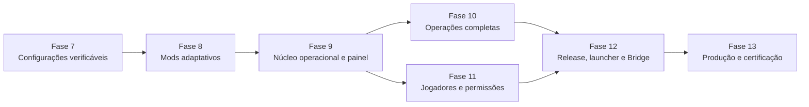

# Plano de implementação das fases finais

Status: **planejamento canônico para execução via terminal**.

Este documento transforma o estado técnico atual da VoidFall em uma sequência de implementação até um painel operacional e uma release certificável. Ele não autoriza tocar o runtime privado, publicar o canal `stable`, instalar o Forge Bridge ou executar ações reais no servidor antes dos gates indicados.

## Como usar este plano

1. Execute uma fatia por vez, na ordem apresentada.
2. Antes de editar, leia `AGENTS.md`, `Plataforma/AGENTS.md`, o documento da fase e os arquivos-alvo.
3. Não misture infraestrutura, domínio, API, painel e documentação em um único commit amplo.
4. Uma caixa marcada neste documento significa código, testes e documentação concluídos; não significa ativação em produção.
5. Nunca marque uma fase como concluída porque o pacote compila. O critério de conclusão de cada fase está descrito abaixo.
6. Preserve `Launcher/workspace/**` e `Servidor/workspace/**` como evidência imutável e ignorada.

## Linha de base

- Fases 1–6: concluídas tecnicamente em isolamento.
- Pré-Fase 7: auditoria documental concluída, com 299 componentes, 298 artefatos e 737 relações declaradas.
- Painel: export estático com fixtures; não representa telemetria real.
- Control API: autenticação, sessão, RBAC, auditoria, servidores e identidade básica do agente.
- Server Agent: registro e heartbeat outbound-only; não executa capacidades operacionais.
- Domínios de processo, backup, configuração, catálogo, release, launcher, jogadores e auditoria: testados principalmente como pacotes isolados.
- Runtime real, provider Minecraft, armazenamento externo, segredos de produção, canal `stable` e Forge Bridge instalado: não conectados.

## Definição de projeto concluído

O projeto só estará concluído quando todos estes resultados existirem simultaneamente:

- painel autenticado usando dados reais e indicando fonte, qualidade e horário;
- operações tipadas passando por Control API, job durável e Server Agent autenticado;
- catálogo de mods persistido, analisável e revisável, sem executar JAR desconhecido;
- incompatibilidades apresentadas com código, severidade, motivo e evidência;
- configuração suportada por schema, revisão, autorização, auditoria e rollback;
- processo, console, arquivos, backups, métricas e agendamentos ligados com locks duráveis;
- jogadores identificados por UUID e ações administrativas ligadas a providers aprovados;
- build reproduzível, artifacts imutáveis, manifesto assinado, promoção e rollback testados;
- launcher validando assinatura/hash e preservando arquivos não gerenciados;
- Forge Bridge empacotado, autenticado e deny-by-default;
- deploy reproduzível, TLS, PostgreSQL, object storage, segredos, monitoramento e recuperação;
- smoke tests reais de cliente, servidor, conexão, mundo novo, backup, restore e rollback;
- gates P0/P1 relevantes resolvidos e documentados.

## Visão das fases finais



| Marco | Quando acontece | Resultado |
| --- | --- | --- |
| Painel executável | já disponível | demonstração estática, sem operação real |
| Painel funcional mínimo | fim da Fase 9 | login, servidor, jobs, configurações, catálogo e incompatibilidades reais |
| Painel funcional completo | fim da Fase 12 | operações, jogadores e pipeline de release integrados |
| Produção liberada | fim da Fase 13 | segurança, deploy, recuperação e smoke tests aprovados |

## Gates transversais

Nenhuma fase pode contornar estes gates:

### Gate G1 — dados e privacidade

- nenhum segredo, chat, coordenada, mundo, UUID privado ou caminho local entra em Git;
- políticas de retenção e acesso existem antes de persistir dados sensíveis;
- auditoria não contém valores de configuração, senhas ou tokens.

### Gate G2 — efeitos externos

- operações aceitam IDs e payloads tipados, nunca shell livre;
- toda mutação possui ator, motivo, idempotência, autorização e evento de auditoria;
- operações destrutivas exigem preflight, backup quando aplicável e recibo final.

### Gate G3 — runtime Minecraft

- testes usam fixtures ou clone isolado até existir autorização operacional;
- start/stop/restore/configuração compartilham lock durável;
- processo órfão e PID são reconciliados após restart do agente.

### Gate G4 — distribuição

- lado, origem, licença, hash e dependências são revisados;
- nenhuma atualização é inferida como segura porque é “mais recente”;
- `stable` exige importação limpa e smoke test cliente-servidor.

### Gate G5 — qualidade

- contrato validado nos dois lados da fronteira;
- testes unitários, integração e segurança para a nova capacidade;
- `npm run check`, auditoria de runtime e matriz Windows/Linux verdes;
- documentação, roadmap e handoff atualizados.

---

## Fase 7 — configurações verificáveis

Objetivo: entregar a primeira configuração realmente operável de ponta a ponta e preparar os schemas específicos de mods sem criar um editor genérico perigoso.

### 7.0 — corrigir a base de compatibilidade usada pelo painel

- [x] separar `launcher_current`, `server_active` e cliente de referência;
- [x] respeitar `CLIENT`, `SERVER` e `BOTH` em cada dependência;
- [x] separar mod raiz de biblioteca JarJar embutida;
- [x] atribuir loader ao componente correto, sem propagar todos os loaders do JAR pai;
- [x] corrigir o baseline NeoForge, sem usar versão Forge como NeoForge;
- [x] interpretar ranges Forge/Maven usados no corpus e retornar `unknown` para formatos não suportados;
- [x] separar conflito canônico, divergência de referência e informação apenas histórica;
- [x] adicionar regressões para Armourer’s Workshop, Epic Fight, KillCam, OpenLoader, Preloading Tricks e WOM;
- [x] regenerar `docs/modpack/**` e comparar as conclusões anteriores.

A implementação deve usar fixtures públicas/sanitizadas. Uma nova leitura dos runtimes privados só pode ocorrer em tarefa forense explicitamente autorizada e separada da implementação da plataforma.

Arquivos principais:

- `tools/modpack/generate_modpack_docs.py`;
- `tools/modpack/validate_modpack_docs.py`;
- `Plataforma/packages/mod-catalog/**`;
- `Plataforma/packages/contracts/**`;
- `docs/modpack/**`.

Gate: o relatório por contexto deve ser determinístico e nunca transformar `unknown` em “compatível”.

Status: concluído em 2026-08-04. A regeneração usa somente fixtures sanitizadas versionadas; os quatro conflitos canônicos permaneceram bloqueadores, enquanto KillCam e Preloading Tricks foram reclassificados como evidência desconhecida de referência. Consulte [Validação da Fase 7.0](PHASE_7_CONTEXTUAL_COMPATIBILITY.md).

### 7.1 — registrar a decisão do primeiro schema

Decisão: usar `openloader_advanced_options_v1`, limitado a `config/openloader/advanced_options.json`. A escolha foi aprovada pelo proprietário e registrada no [ADR-008](DECISIONS/ADR-008-openloader-como-primeiro-schema.md); os packs em `data/` e `resources/` permanecem fora do editor.

- [x] criar ADR com proprietário, versão, campos permitidos e motivo da escolha;
- [x] marcar apenas o candidato aprovado como selecionado;
- [x] definir parser, serializador, limites, segredo, restart e migração;
- [x] criar fixtures públicas sanitizadas;
- [x] proibir paths e schemas fornecidos pelo usuário.

Gate: sem ADR e schema congelado, não iniciar API ou painel de edição.

Status: concluído em 2026-08-04. O schema aceita somente os dois campos booleanos `enabled`, fixa `additionalFolders` como vazio, exige restart e possui codec/fixtures determinísticos em `@voidfall/configuration-schemas`. O gate local e a [matriz Windows/Linux 30943931215](https://github.com/Myerzx/Void-Modpack/actions/runs/30943931215) passaram. Persistência e aplicação real continuam bloqueadas até a Fase 7.2.

### 7.2 — persistência e operação de configuração

- [x] criar migração para schemas, recursos, revisões e estado de aplicação;
- [x] implementar repositórios PostgreSQL e concorrência otimista;
- [x] ligar `configuration-schemas` ao `server-configuration` por registro confiável;
- [x] correlacionar revisão preparada, aplicação, falha e rollback;
- [x] integrar lock operacional compartilhado;
- [x] registrar ator, motivo e auditoria sem valores sensíveis.

Status: concluído tecnicamente em isolamento em 2026-08-04. O registro de produto aceita somente o codec OpenLoader revisado; a migration `0004_configuration_operations.sql` persiste schemas, recursos, revisões, estado e lock compartilhado; e `PersistentConfigurationService` correlaciona PostgreSQL, filesystem temporário, falha e rollback sem persistir valores. Consulte [Persistência e operação da Fase 7.2](PHASE_7_CONFIGURATION_PERSISTENCE.md). API, agente e painel permanecem fora deste recorte.

### 7.3 — API, agente e painel

- [ ] `GET` de schemas e recursos autorizados;
- [ ] `GET` de valores redigidos e revisões;
- [ ] `POST` de validação sem aplicação;
- [ ] `POST` de aplicação com hash esperado e chave de idempotência;
- [ ] `POST` de rollback para revisão elegível;
- [ ] operação tipada no Server Agent;
- [ ] página de configuração com diff seguro, restart visível e estados de erro;
- [ ] teste E2E contra diretório temporário, nunca runtime privado.

Critério de conclusão da Fase 7:

- uma configuração suportada percorre painel → API → job/agente → filesystem isolado → auditoria;
- validação, concorrência, falha e rollback estão testados;
- nenhum formato não registrado pode ser editado.

Commits sugeridos:

- `fix(modpack-audit): evaluate compatibility by runtime context`;
- `docs(decision): select first configuration schema`;
- `feat(configuration): persist reviewed schemas and revisions`;
- `feat(control-api): expose audited configuration operations`;
- `feat(panel): add typed configuration workflow`.

---

## Fase 8 — entrada adaptativa de mods e incompatibilidades

Objetivo: permitir adicionar um artefato para análise, registrar incompatibilidades e explicar o motivo, sem instalar ou corrigir automaticamente.

### 8.1 — inspeção segura de artefato

- [ ] criar `packages/artifact-inspection` ou responsabilidade equivalente isolada;
- [ ] ler ZIP central directory, `mods.toml`, `neoforge.mods.toml`, `fabric.mod.json`, manifesto e JarJar;
- [ ] limitar tamanho expandido, quantidade de entradas, profundidade e nomes;
- [ ] rejeitar path traversal, ZIP bomb, arquivo truncado e metadata excessiva;
- [ ] nunca carregar classe, executar JAR ou deserializar objeto arbitrário;
- [ ] emitir relatório versionado com hash e evidências.

### 8.2 — motor de compatibilidade

- [ ] comparar Minecraft, loader, loader version, lado e dependências por contexto;
- [ ] resolver ranges suportados e manter os demais como `unknown` bloqueante;
- [ ] detectar IDs, hashes e filenames duplicados;
- [ ] detectar dependência obrigatória ausente, ciclo e conflito explícito;
- [ ] classificar issue como `blocker`, `warning` ou `information`;
- [ ] manter códigos estáveis e mensagem humana separada;
- [ ] produzir explicação, evidência e ação manual recomendada, sem inventar correção.

Códigos mínimos:

- `minecraft-version-mismatch`;
- `loader-mismatch`;
- `loader-version-mismatch`;
- `side-mismatch`;
- `missing-required-dependency`;
- `dependency-version-mismatch`;
- `duplicate-mod-id`;
- `duplicate-content`;
- `filename-collision`;
- `explicit-conflict`;
- `metadata-unverified`;
- `distribution-unreviewed`.

### 8.3 — persistência, API e revisão

- [ ] persistir upload, quarentena, inspeção, issues e decisão humana;
- [ ] endpoint streaming autenticado com limite e rate limit;
- [ ] jobs duráveis para inspeção e análise;
- [ ] estados `uploaded`, `quarantined`, `analyzing`, `blocked`, `reviewable`, `approved`, `rejected`;
- [ ] aprovação não instala o mod; apenas altera o estado de revisão;
- [ ] toda decisão registra ator, motivo e hash analisado.

### 8.4 — experiência do painel

- [ ] lista compacta de mods com busca, lado, versão e estado;
- [ ] upload com progresso e estado de quarentena;
- [ ] janela/drawer de incompatibilidade com severidade, motivo e evidência;
- [ ] filtro por blocker/warning/information;
- [ ] grafo de dependências sob demanda;
- [ ] botão de instalação ausente ou desabilitado nesta fase;
- [ ] fixture de erro substituída por dados reais da API quando disponível.

Critério de conclusão da Fase 8:

- um JAR de teste entra em quarentena, é inspecionado sem execução e gera relatório persistido;
- qualquer incompatibilidade mínima aparece no painel e fica auditada;
- nenhum artefato analisado alcança o runtime Minecraft.

Commits sugeridos:

- `feat(artifact-inspection): parse bounded loader metadata`;
- `feat(mod-catalog): report contextual compatibility issues`;
- `feat(database): persist artifact analysis workflow`;
- `feat(control-api): add quarantined mod analysis endpoints`;
- `feat(panel): show mod compatibility findings`.

---

## Fase 9 — núcleo operacional e painel funcional mínimo

Objetivo: conectar os domínios já testados à aplicação real sem liberar todas as ações perigosas de uma vez.

### 9.1 — contratos operacionais e persistência

- [ ] persistir comandos, idempotência, locks, PID observado e recibos;
- [ ] persistir catálogos, configurações, análises e jobs atualmente em memória;
- [ ] criar paginação, filtros e limites para endpoints administrativos;
- [ ] correlacionar job, operação do agente e evento de auditoria;
- [ ] adicionar outbox/eventos sem dual write.

### 9.2 — transporte real Control API ↔ Server Agent

- [ ] mTLS ou transporte autenticado aprovado;
- [ ] rotação/revogação de identidade do agente;
- [ ] protocolo outbound-only com lease e replay protection;
- [ ] supervisor do agente e reconciliação após restart;
- [ ] capacidades anunciadas e autorizadas individualmente;
- [ ] nenhuma operação genérica ou payload extensível executável.

### 9.3 — painel dinâmico

- [ ] login/logout/sessão consumindo Control API;
- [ ] seletor de instância real;
- [ ] dashboard com fonte, qualidade e timestamp;
- [ ] páginas de servidor, jobs, mods, configurações e auditoria;
- [ ] estados loading, vazio, indisponível, negado e erro;
- [ ] esconder ações sem permissão;
- [ ] manter mutações perigosas desabilitadas até a fase correspondente.

Critério de conclusão da Fase 9:

- painel deixa de depender de fixtures para as áreas implementadas;
- API e agente trocam comandos inofensivos e estados reais em ambiente de integração;
- reinício de API/agent não perde idempotência nem cria operação duplicada.

---

## Fase 10 — operações completas do servidor

Objetivo: tornar processo, console, arquivos, backups, métricas, logs e agendamentos operáveis com segurança.

### 10.1 — processo e console

- [ ] lock durável compartilhado e reconciliação de PID/processo órfão;
- [ ] start, stop e restart com timeout, estado observado e recuperação;
- [ ] cursor de console, limitação, redação e retenção;
- [ ] comandos continuam em catálogo fechado;
- [ ] force kill permanece em fluxo separado e altamente restrito.

### 10.2 — arquivos e configurações

- [ ] descoberta somente em raízes autorizadas;
- [ ] criar, renomear, mover, copiar e excluir com revisão e política;
- [ ] upload/download limitados e sem execução;
- [ ] proteção contra junction, symlink e alias cross-platform;
- [ ] diff e restauração de texto sem revelar segredos.

### 10.3 — backups e restore

- [ ] backend local/objeto escolhido;
- [ ] quotas, retenção, criptografia e integridade autenticada;
- [ ] backup offline ou protocolo online confirmado pelo Forge Bridge;
- [ ] restore com preflight, parada, lock, troca atômica e boot de verificação;
- [ ] ensaio de disaster recovery documentado.

### 10.4 — métricas, logs e alertas

- [ ] coleta autenticada de host, processo e JVM;
- [ ] TPS/MSPT via provider aprovado;
- [ ] armazenamento agregado com retenção;
- [ ] logs estruturados, agrupamento de erro e correlação;
- [ ] alertas de disco, memória, crash, agente offline e job falho;
- [ ] cada valor mostra fonte e qualidade.

### 10.5 — agendamentos

- [ ] agenda persistente com timezone explícito;
- [ ] avisos, backup, manutenção e restart como passos tipados;
- [ ] lease, deduplicação, cancelamento e recuperação após crash;
- [ ] verificação pós-restart antes de concluir.

Critério de conclusão da Fase 10:

- todas as operações passam por RBAC, job, agente, lock, auditoria e recibo;
- backup e restore completam um ensaio em ambiente isolado;
- o painel não apresenta métrica simulada como real.

---

## Fase 11 — jogadores, permissões e moderação reais

Objetivo: conectar o domínio puro da Fase 6 a providers aprovados e às telas operacionais.

- [ ] decidir autenticação Minecraft e provider de permissões em ADRs;
- [ ] persistir perfis, aliases, bindings, casos e recibos;
- [ ] implementar importação/reconciliação por UUID sem confiar em nome;
- [ ] ligar provider Forge deny-by-default;
- [ ] ligar executor tipado de kick, ban, mute, whitelist e grupo;
- [ ] exigir motivo e autorização por ação;
- [ ] definir política de chat, coordenadas e atividade antes da coleta;
- [ ] criar API paginada e telas de perfil, histórico e moderação;
- [ ] auditar leitura de dados sensíveis e aplicar retenção;
- [ ] testar expiração, concorrência e falha do provider.

Critério de conclusão da Fase 11:

- identidade é UUID, `player` continua grupo padrão e nenhum fake é tratado como provider real;
- ações administrativas possuem recibo do provider e auditoria;
- dados sem política aprovada continuam indisponíveis.

---

## Fase 12 — release, launcher e Forge Bridge

Objetivo: ativar o pipeline reproduzível e a atualização do cliente depois de resolver os gates de distribuição.

### 12.1 — catálogo e build de produção

- [ ] escolher o cliente-base canônico;
- [ ] concluir origem, licença, lado e distribuição dos artifacts;
- [ ] persistir planos de build e inputs imutáveis;
- [ ] integrar object storage e políticas de retenção;
- [ ] executar build em sandbox com quotas e limpeza garantida;
- [ ] importar do zero e provar reprodutibilidade.

### 12.2 — assinatura, canais e launcher

- [ ] provisionar Ed25519 em cofre/HSM ou secret store aprovado;
- [ ] documentar rotação, revogação e cerimônia de promoção;
- [ ] publicar candidatos imutáveis;
- [ ] promover canal por CAS e rollback por ponteiro;
- [ ] launcher verifica assinatura, hash, tamanho e propriedade do arquivo;
- [ ] preservar arquivos do jogador não gerenciados;
- [ ] testar ao menos os launchers escolhidos no P0.

### 12.3 — Forge Bridge e `/atualizar-modpack`

- [ ] empacotar Bridge como mod Forge 1.20.1 Java 17;
- [ ] implementar adapter Forge de permissão e transporte local autenticado;
- [ ] assinar request, nonce, expiração e identidade do servidor;
- [ ] comando cria job, nunca shell e nunca promoção automática de `stable`;
- [ ] resposta no jogo acompanha job e informa falha sem segredo;
- [ ] teste real deny-by-default e de replay.

### 12.4 — certificação da release

- [ ] importação limpa;
- [ ] boot cliente e servidor;
- [ ] conexão multiplayer;
- [ ] resource packs, texturas, scripts e menus;
- [ ] mundo novo e cópia isolada do mundo;
- [ ] restart, backup e restore;
- [ ] atualização incremental e rollback do launcher;
- [ ] registro de evidências e aprovador.

Critério de conclusão da Fase 12:

- canal candidato pode ser construído, assinado, instalado, testado e revertido;
- `stable` continua bloqueado se qualquer artifact ou smoke test estiver pendente.

---

## Fase 13 — produção, segurança e encerramento

Objetivo: transformar o sistema integrado em serviço recuperável e auditável de produção.

### 13.1 — decisões finais obrigatórias

- [ ] ambiente oficial Windows/Linux;
- [ ] topologia de autenticação Minecraft;
- [ ] acesso do painel: internet, VPN ou LAN;
- [ ] object storage e retenção;
- [ ] política de dados e responsáveis;
- [ ] aprovadores de `stable` e rollback;
- [ ] suporte inicial de launchers e instâncias.

### 13.2 — implantação

- [ ] reverse proxy, HTTPS e headers de segurança;
- [ ] PostgreSQL com backup e migração automatizada;
- [ ] object storage com credenciais mínimas;
- [ ] serviços sem root e filesystem mínimo;
- [ ] secret store e rotação;
- [ ] health/readiness e deploy com rollback;
- [ ] observabilidade da própria plataforma.

### 13.3 — segurança e resiliência

- [ ] threat model atualizado;
- [ ] testes de autorização horizontal/vertical;
- [ ] CSRF, rate limiting, replay, upload e ZIP bomb;
- [ ] path traversal, junction/symlink e command injection;
- [ ] teste de restauração do banco, artifacts e configuração;
- [ ] perda de agente, worker, banco e storage;
- [ ] auditoria de dependências e SBOM;
- [ ] revisão de segredos e dados privados.

### 13.4 — aceite final

- [ ] E2E do painel para cada fluxo crítico;
- [ ] matriz Windows/Linux aplicável;
- [ ] runbooks de incidente, deploy, backup, restore e rotação;
- [ ] documentação e ADRs sem pendência silenciosa;
- [ ] changelog e versão inicial;
- [ ] aceite do proprietário para ativação operacional;
- [ ] canal `stable` promovido somente após todos os gates.

Critério de conclusão da Fase 13:

- sistema pode ser instalado do zero, operado, monitorado, atualizado e recuperado seguindo documentação;
- um incidente não exige acesso manual não documentado ao runtime para restaurar o serviço;
- riscos aceitos têm proprietário e justificativa.

---

## Protocolo de execução no terminal

### Início de uma sessão

```powershell
Set-Location 'H:\void pasta'
git status --short --branch
Get-Content -Raw AGENTS.md
Get-Content -Raw Plataforma/AGENTS.md
Get-Content -Raw docs/plataforma/FINAL_IMPLEMENTATION_PLAN.md
```

Não use `git reset --hard`, não limpe o worktree e não inclua alterações preexistentes sem inspeção.

### Baseline antes de uma fase

```powershell
Set-Location 'H:\void pasta\Plataforma'
npm ci
npm run check
npm audit --omit=dev
```

Se o baseline falhar, registre o erro como preexistente antes de implementar.

### Ciclo de cada fatia

1. Escolher um item pequeno deste plano.
2. Identificar contrato e trust boundary.
3. Escrever/atualizar teste que demonstra o comportamento.
4. Implementar somente a capacidade da fatia.
5. Rodar teste do workspace afetado.
6. Rodar typecheck/build aplicáveis.
7. Atualizar documento da fase, roadmap e handoff.
8. Revisar `git diff` e `git diff --check`.
9. Criar commit Conventional Commit em inglês.
10. Rodar gate completo antes de encerrar a fase.

### Comandos de validação por escopo

```powershell
# Workspace específico
npm run build --workspace @voidfall/mod-catalog
npm run typecheck --workspace @voidfall/mod-catalog
npm run test --workspace @voidfall/mod-catalog

# Plataforma completa
npm run check
npm audit --omit=dev

# Base documental do modpack
$python = Get-Content ..\graphify-out\.graphify_python
& $python ..\tools\modpack\validate_modpack_docs.py --root ..

# Documentação pública do cliente/servidor quando aplicável
Set-Location '..'
& .\Launcher\tools\Test-LauncherPack.ps1
& .\Servidor\tools\Test-ServerDocumentation.ps1
```

### Divisão obrigatória de commits

- contratos e schemas;
- migração/repositório;
- domínio/serviço;
- agente/worker/integração;
- API;
- painel;
- testes/fixtures quando forem um recorte independente;
- documentação/handoff;
- Graphify.

Não agrupe todos esses escopos em um único commit de fase.

## Primeira sequência recomendada

Execute nesta ordem:

1. Fase 7.0: corrigir o analisador por contexto e lado.
2. Fase 7.1: registrar ADR do primeiro schema.
3. Fase 7.2: persistência e operação da configuração.
4. Fase 7.3: API, agente e painel da configuração.
5. Fase 8.1–8.2: inspeção segura e motor de incompatibilidades.
6. Fase 8.3–8.4: persistência, API e janela de erro de mods.
7. Somente depois iniciar o wiring operacional da Fase 9.

O primeiro objetivo visível é a janela de incompatibilidades; o primeiro objetivo operacional é uma configuração tipada com rollback em ambiente isolado.

## Saída esperada de cada sessão

O handoff deve registrar:

- fase e item executado;
- arquivos e contratos alterados;
- decisões e ADRs;
- testes e respectivos resultados;
- erros preexistentes e novos;
- riscos que continuam abertos;
- commits criados;
- próximo item exato deste plano;
- confirmação de que runtimes privados não foram modificados.
