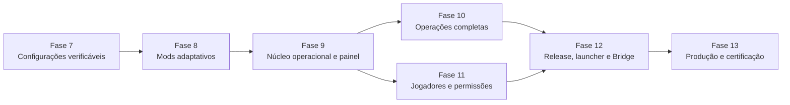

# Plano de implementação das fases finais

Status: **planejamento canônico para execução via terminal**.

Este documento transforma o estado técnico atual da VoidFall em uma sequência de implementação até um painel operacional e uma release certificável. Ele não autoriza tocar o runtime privado, publicar o canal `stable`, instalar o Forge Bridge ou executar ações reais no servidor antes dos gates indicados.

## Como usar este plano

1. Execute uma fatia por vez, na ordem apresentada.
2. Antes de editar, leia `AGENTS.md`, `Plataforma/AGENTS.md`, o documento da fase e os arquivos-alvo.
3. Não misture infraestrutura, domínio, API, painel e documentação em um único commit amplo.
4. Uma caixa marcada neste documento significa código, testes e documentação concluídos; não significa ativação em produção.
5. Nunca marque uma fase como concluída porque o pacote compila. O critério de conclusão de cada fase está descrito abaixo.
6. Preserve `Launcher/workspace/**` e `Servidor/workspace/**` como evidência imutável e ignorada.

## Linha de base

- Fases 1–6: concluídas tecnicamente em isolamento.
- Pré-Fase 7: auditoria documental concluída, com 299 componentes, 298 artefatos e 737 relações declaradas.
- Painel: export estático com fixtures; não representa telemetria real.
- Control API: autenticação, sessão, RBAC, auditoria, servidores e identidade básica do agente.
- Server Agent: registro e heartbeat outbound-only; não executa capacidades operacionais.
- Domínios de processo, backup, configuração, catálogo, release, launcher, jogadores e auditoria: testados principalmente como pacotes isolados.
- Runtime real, provider Minecraft, armazenamento externo, segredos de produção, canal `stable` e Forge Bridge instalado: não conectados.

## Definição de projeto concluído

O projeto só estará concluído quando todos estes resultados existirem simultaneamente:

- painel autenticado usando dados reais e indicando fonte, qualidade e horário;
- operações tipadas passando por Control API, job durável e Server Agent autenticado;
- catálogo de mods persistido, analisável e revisável, sem executar JAR desconhecido;
- incompatibilidades apresentadas com código, severidade, motivo e evidência;
- configuração suportada por schema, revisão, autorização, auditoria e rollback;
- processo, console, arquivos, backups, métricas e agendamentos ligados com locks duráveis;
- jogadores identificados por UUID e ações administrativas ligadas a providers aprovados;
- build reproduzível, artifacts imutáveis, manifesto assinado, promoção e rollback testados;
- launcher validando assinatura/hash e preservando arquivos não gerenciados;
- Forge Bridge empacotado, autenticado e deny-by-default;
- deploy reproduzível, TLS, PostgreSQL, object storage, segredos, monitoramento e recuperação;
- smoke tests reais de cliente, servidor, conexão, mundo novo, backup, restore e rollback;
- gates P0/P1 relevantes resolvidos e documentados.

## Visão das fases finais



| Marco | Quando acontece | Resultado |
| --- | --- | --- |
| Painel executável | já disponível | demonstração estática, sem operação real |
| Painel funcional mínimo | fim da Fase 9 | login, servidor, jobs, configurações, catálogo e incompatibilidades reais |
| Painel funcional completo | fim da Fase 12 | operações, jogadores e pipeline de release integrados |
| Produção liberada | fim da Fase 13 | segurança, deploy, recuperação e smoke tests aprovados |

## Gates transversais

Nenhuma fase pode contornar estes gates:

### Gate G1 — dados e privacidade

- nenhum segredo, chat, coordenada, mundo, UUID privado ou caminho local entra em Git;
- políticas de retenção e acesso existem antes de persistir dados sensíveis;
- auditoria não contém valores de configuração, senhas ou tokens.

### Gate G2 — efeitos externos

- operações aceitam IDs e payloads tipados, nunca shell livre;
- toda mutação possui ator, motivo, idempotência, autorização e evento de auditoria;
- operações destrutivas exigem preflight, backup quando aplicável e recibo final.

### Gate G3 — runtime Minecraft

- testes usam fixtures ou clone isolado até existir autorização operacional;
- start/stop/restore/configuração compartilham lock durável;
- processo órfão e PID são reconciliados após restart do agente.

### Gate G4 — distribuição

- lado, origem, licença, hash e dependências são revisados;
- nenhuma atualização é inferida como segura porque é “mais recente”;
- `stable` exige importação limpa e smoke test cliente-servidor.

### Gate G5 — qualidade

- contrato validado nos dois lados da fronteira;
- testes unitários, integração e segurança para a nova capacidade;
- `npm run check`, auditoria de runtime e matriz Windows/Linux verdes;
- documentação, roadmap e handoff atualizados.

---

## Fase 7 — configurações verificáveis

Objetivo: entregar a primeira configuração realmente operável de ponta a ponta e preparar os schemas específicos de mods sem criar um editor genérico perigoso.

### 7.0 — corrigir a base de compatibilidade usada pelo painel

- [x] separar `launcher_current`, `server_active` e cliente de referência;
- [x] respeitar `CLIENT`, `SERVER` e `BOTH` em cada dependência;
- [x] separar mod raiz de biblioteca JarJar embutida;
- [x] atribuir loader ao componente correto, sem propagar todos os loaders do JAR pai;
- [x] corrigir o baseline NeoForge, sem usar versão Forge como NeoForge;
- [x] interpretar ranges Forge/Maven usados no corpus e retornar `unknown` para formatos não suportados;
- [x] separar conflito canônico, divergência de referência e informação apenas histórica;
- [x] adicionar regressões para Armourer’s Workshop, Epic Fight, KillCam, OpenLoader, Preloading Tricks e WOM;
- [x] regenerar `docs/modpack/**` e comparar as conclusões anteriores.

A implementação deve usar fixtures públicas/sanitizadas. Uma nova leitura dos runtimes privados só pode ocorrer em tarefa forense explicitamente autorizada e separada da implementação da plataforma.

Arquivos principais:

- `tools/modpack/generate_modpack_docs.py`;
- `tools/modpack/validate_modpack_docs.py`;
- `Plataforma/packages/mod-catalog/**`;
- `Plataforma/packages/contracts/**`;
- `docs/modpack/**`.

Gate: o relatório por contexto deve ser determinístico e nunca transformar `unknown` em “compatível”.

Status: concluído em 2026-08-04. A regeneração usa somente fixtures sanitizadas versionadas; os quatro conflitos canônicos permaneceram bloqueadores, enquanto KillCam e Preloading Tricks foram reclassificados como evidência desconhecida de referência. Consulte [Validação da Fase 7.0](PHASE_7_CONTEXTUAL_COMPATIBILITY.md).

### 7.1 — registrar a decisão do primeiro schema

Decisão: usar `openloader_advanced_options_v1`, limitado a `config/openloader/advanced_options.json`. A escolha foi aprovada pelo proprietário e registrada no [ADR-008](DECISIONS/ADR-008-openloader-como-primeiro-schema.md); os packs em `data/` e `resources/` permanecem fora do editor.

- [x] criar ADR com proprietário, versão, campos permitidos e motivo da escolha;
- [x] marcar apenas o candidato aprovado como selecionado;
- [x] definir parser, serializador, limites, segredo, restart e migração;
- [x] criar fixtures públicas sanitizadas;
- [x] proibir paths e schemas fornecidos pelo usuário.

Gate: sem ADR e schema congelado, não iniciar API ou painel de edição.

Status: concluído em 2026-08-04. O schema aceita somente os dois campos booleanos `enabled`, fixa `additionalFolders` como vazio, exige restart e possui codec/fixtures determinísticos em `@voidfall/configuration-schemas`. O gate local e a [matriz Windows/Linux 30943931215](https://github.com/Myerzx/Void-Modpack/actions/runs/30943931215) passaram. A persistência e a aplicação isolada foram concluídas na Fase 7.2; integração operacional continua bloqueada até a Fase 7.3.

### 7.2 — persistência e operação de configuração

- [x] criar migração para schemas, recursos, revisões e estado de aplicação;
- [x] implementar repositórios PostgreSQL e concorrência otimista;
- [x] ligar `configuration-schemas` ao `server-configuration` por registro confiável;
- [x] correlacionar revisão preparada, aplicação, falha e rollback;
- [x] integrar lock operacional compartilhado;
- [x] registrar ator, motivo e auditoria sem valores sensíveis.

Status: concluído tecnicamente em isolamento em 2026-08-04. O registro de produto aceita somente o codec OpenLoader revisado; a migration `0004_configuration_operations.sql` persiste schemas, recursos, revisões, estado e lock compartilhado; e `PersistentConfigurationService` correlaciona PostgreSQL, filesystem temporário, falha e rollback sem persistir valores. O gate local e a [matriz Windows/Linux 30952093047](https://github.com/Myerzx/Void-Modpack/actions/runs/30952093047) passaram. Consulte [Persistência e operação da Fase 7.2](PHASE_7_CONFIGURATION_PERSISTENCE.md). API, agente e painel permanecem fora deste recorte.

### 7.3 — API, agente e painel

- [x] `GET` de schemas e recursos autorizados;
- [x] `GET` de valores redigidos e revisões;
- [x] `POST` de validação sem aplicação;
- [x] `POST` de aplicação com hash esperado e chave de idempotência;
- [x] `POST` de rollback para revisão elegível;
- [x] operação tipada no Server Agent;
- [x] página de configuração com diff seguro, restart visível e estados de erro;
- [x] teste E2E contra diretório temporário, nunca runtime privado.

Critério de conclusão da Fase 7:

- [x] uma configuração suportada percorre painel → API → job/agente → filesystem isolado → auditoria;
- [x] validação, concorrência, falha e rollback estão testados;
- [x] nenhum formato não registrado pode ser editado.

Status: concluída tecnicamente em isolamento em 2026-08-04. Os contratos v1 fixam identificadores e valores escalares revisados sem payload extensível; a migration `0005_configuration_permissions.sql` mantém as quatro permissões deny-by-default; a capability `configuration.apply` resolve raiz, path, schema e codec somente por configuração confiável local; e o painel expõe diff seguro com restart apenas como metadata. O gate local e a [matriz Windows/Linux 30958519999](https://github.com/Myerzx/Void-Modpack/actions/runs/30958519999) passaram. Consulte [API, agente e painel da Fase 7.3](PHASE_7_CONFIGURATION_API.md).

Commits sugeridos:

- `fix(modpack-audit): evaluate compatibility by runtime context`;
- `docs(decision): select first configuration schema`;
- `feat(configuration): persist reviewed schemas and revisions`;
- `feat(control-api): expose audited configuration operations`;
- `feat(panel): add typed configuration workflow`.

---

## Fase 8 — entrada adaptativa de mods e incompatibilidades

Objetivo: permitir adicionar um artefato para análise, registrar incompatibilidades e explicar o motivo, sem instalar ou corrigir automaticamente.

### 8.1 — inspeção segura de artefato

- [x] criar `packages/artifact-inspection` ou responsabilidade equivalente isolada;
- [x] ler ZIP central directory, `mods.toml`, `neoforge.mods.toml`, `fabric.mod.json`, manifesto e JarJar;
- [x] limitar tamanho expandido, quantidade de entradas, profundidade e nomes;
- [x] rejeitar path traversal, ZIP bomb, arquivo truncado e metadata excessiva;
- [x] nunca carregar classe, executar JAR ou deserializar objeto arbitrário;
- [x] emitir relatório versionado com hash e evidências.

Status: concluída tecnicamente em isolamento em 2026-08-04. `@voidfall/artifact-inspection` lê somente o conjunto fechado de descritores revisados e infla apenas eles; o único decodificador é DEFLATE bruto do `node:zlib`, nenhum JAR aninhado é aberto e nada é escrito em disco. Uma versão declarada como `${file.jarVersion}` só é resolvida pelo manifesto que a declara e, caso contrário, permanece literal. Um descritor presente mas ilegível dentro do subconjunto estrito vira issue registrada, nunca omissão. As fixtures são construídas em código por um escritor ZIP determinístico, de modo que cada campo corrompido por um teste permanece revisável no diff. O gate local e a [matriz Windows/Linux 30961224930](https://github.com/Myerzx/Void-Modpack/actions/runs/30961224930) passaram. Consulte [Inspeção segura de artefato da Fase 8.1](PHASE_8_ARTIFACT_INSPECTION.md).

### 8.2 — motor de compatibilidade

- [x] comparar Minecraft, loader, loader version, lado e dependências por contexto;
- [x] resolver ranges suportados e manter os demais como `unknown` bloqueante;
- [x] detectar IDs, hashes e filenames duplicados;
- [x] detectar dependência obrigatória ausente, ciclo e conflito explícito;
- [x] classificar issue como `blocker`, `warning` ou `information`;
- [x] manter códigos estáveis e mensagem humana separada;
- [x] produzir explicação, evidência e ação manual recomendada, sem inventar correção.

Códigos mínimos:

- `minecraft-version-mismatch`;
- `loader-mismatch`;
- `loader-version-mismatch`;
- `side-mismatch`;
- `missing-required-dependency`;
- `dependency-version-mismatch`;
- `duplicate-mod-id`;
- `duplicate-content`;
- `filename-collision`;
- `explicit-conflict`;
- `metadata-unverified`;
- `distribution-unreviewed`.

Status: concluída tecnicamente em isolamento em 2026-08-05. `@voidfall/artifact-compatibility` julga as declarações da Fase 8.1 contra um ou mais contextos alvo e separa dois eixos: `code` nomeia o assunto e é estável, `determinacy` diz se aquilo foi provado ou apenas não pôde ser descartado. O contrato recusa qualquer issue `unproven` que não bloqueie, então desconhecido bloqueia sem virar defeito provado. Além dos doze códigos mínimos, `dependency-cycle` cobre mods que se exigem mutuamente. Lado e conflito explícito vêm de revisão humana, nunca de presença ou filename; uma dependência obrigatória ausente vira `possibly-embedded` e não provada quando o artefato declara bibliotecas JarJar que nunca foram abertas; e o avaliador de ranges Maven da Fase 7.0 é reutilizado em vez de reimplementado. O `detail` é sanitizado pelo motor contra um charset sem separador de caminho nem prefixo de unidade. O gate local e a [matriz Windows/Linux 30974767140](https://github.com/Myerzx/Void-Modpack/actions/runs/30974767140) passaram. Consulte [Motor de compatibilidade da Fase 8.2](PHASE_8_COMPATIBILITY_ENGINE.md).

### 8.3 — persistência, API e revisão

- [x] persistir upload, quarentena, inspeção, issues e decisão humana;
- [x] endpoint streaming autenticado com limite e rate limit;
- [x] jobs duráveis para inspeção e análise;
- [x] estados `uploaded`, `quarantined`, `analyzing`, `blocked`, `reviewable`, `approved`, `rejected`;
- [x] aprovação não instala o mod; apenas altera o estado de revisão;
- [x] toda decisão registra ator, motivo e hash analisado.

Status: concluída tecnicamente em isolamento em 2026-08-05. A migration `0006_artifact_review.sql` guarda submissões, os dois relatórios, as issues como linhas e um log append-only de decisões; a máquina de estados é validada no contrato, no repositório e nas CHECKs do banco. Uma decisão nomeia o hash analisado e a versão lida, então uma decisão sobre análise obsoleta é recusada em vez de aplicada, e `blocked` só sai por rejeição explícita. O upload é streaming, recusa pelo `content-length` antes de ler um byte e depende de uma quarentena injetada — sem ela responde `503`. Os jobs `artifact.inspect` e `artifact.analyze` reutilizam a fila `SKIP LOCKED` e carregam apenas referência opaca. Nenhuma permissão nova foi criada: `mods.view`/`mods.manage`/`mods.classify` já eram menor privilégio. O gate local e a [matriz Windows/Linux 30977108776](https://github.com/Myerzx/Void-Modpack/actions/runs/30977108776) passaram. Consulte [Persistência, API e painel das Fases 8.3 e 8.4](PHASE_8_ARTIFACT_REVIEW.md).

### 8.4 — experiência do painel

- [x] lista compacta de mods com busca, lado, versão e estado;
- [x] upload com progresso e estado de quarentena;
- [x] janela/drawer de incompatibilidade com severidade, motivo e evidência;
- [x] filtro por blocker/warning/information;
- [x] grafo de dependências sob demanda;
- [x] botão de instalação ausente ou desabilitado nesta fase;
- [x] fixture de erro substituída por dados reais da API quando disponível.

Status: concluída tecnicamente em isolamento em 2026-08-05. O view model é puro e testável sem navegador: a busca cobre arquivo, mod id e prefixo de hash; o progresso descreve somente bytes enviados, porque quarentena e análise são passos duráveis à parte; o grafo é derivado sob demanda do que o artefato declara, sem abrir JAR aninhado. Um lado que ninguém revisou aparece como não revisado, e um bloqueio apenas não comprovado é apresentado como tal. `buildInstallActionView()` devolve `present: false` por construção, de modo que nenhuma tela consegue renderizar um botão de instalação habilitado.

Critério de conclusão da Fase 8:

- um JAR de teste entra em quarentena, é inspecionado sem execução e gera relatório persistido;
- qualquer incompatibilidade mínima aparece no painel e fica auditada;
- nenhum artefato analisado alcança o runtime Minecraft.

Commits sugeridos:

- `feat(artifact-inspection): parse bounded loader metadata`;
- `feat(mod-catalog): report contextual compatibility issues`;
- `feat(database): persist artifact analysis workflow`;
- `feat(control-api): add quarantined mod analysis endpoints`;
- `feat(panel): show mod compatibility findings`.

---

## Fase 9 — núcleo operacional e painel funcional mínimo

Objetivo: conectar os domínios já testados à aplicação real sem liberar todas as ações perigosas de uma vez.

### 9.1 — contratos operacionais e persistência

- [x] persistir comandos, idempotência, locks, PID observado e recibos;
- [x] persistir catálogos, configurações, análises e jobs atualmente em memória;
- [x] criar paginação, filtros e limites para endpoints administrativos;
- [x] correlacionar job, operação do agente e evento de auditoria;
- [x] adicionar outbox/eventos sem dual write.

Status: concluída tecnicamente em isolamento em 2026-08-05. A migration `0007_operational_core.sql` guarda operações com recibo, estado observado do processo, o outbox e o catálogo revisado. Três propriedades passam a sobreviver a um restart: a idempotência, por chave única mais fingerprint dos campos estáveis do pedido; a exclusão mútua, por índice único parcial que permite no máximo uma operação em voo por servidor; e o PID observado, sempre acompanhado do `boot_id` que o identifica. O evento de outbox é escrito na mesma transação da mudança de estado, e a entrega é marcada depois de acontecer, logo a garantia é at-least-once. Um `correlationId` atravessa operação, job e auditoria, e `GET /api/v1/correlations/:correlationId` devolve os três juntos. Toda listagem administrativa é limitada na rota e novamente no repositório, e um limite acima do máximo é recusado em vez de reduzido em silêncio. O gate local e a [matriz Windows/Linux 30989284065](https://github.com/Myerzx/Void-Modpack/actions/runs/30989284065) passaram. Consulte [Núcleo operacional da Fase 9.1](PHASE_9_OPERATIONAL_CORE.md).

### 9.2 — transporte real Control API ↔ Server Agent

- [x] mTLS ou transporte autenticado aprovado;
- [x] rotação/revogação de identidade do agente;
- [x] protocolo outbound-only com lease e replay protection;
- [x] supervisor do agente e reconciliação após restart;
- [x] capacidades anunciadas e autorizadas individualmente;
- [x] nenhuma operação genérica ou payload extensível executável.

Status: concluída tecnicamente em isolamento em 2026-08-05. A migration `0008_agent_transport.sql` acrescenta histórico de credenciais, concessões de capacidade e leases de trabalho. A rotação substitui em vez de editar, então um fingerprint superado nunca mais autentica; a revogação retira credencial e concessões juntas. Uma capacidade anunciada não autoriza nada — só a concessão autoriza, e o claim confere também os tipos de job que aquela capacidade pode servir. `claimWork` reserva o job e grava o lease na mesma transação, e `reclaimExpiredLeases` devolve à fila enquanto houver tentativa ou falha de vez quando o orçamento acabou, sem nunca deixar job preso em `running`. O supervisor espera o intervalo que o plano de controle pede, recua geometricamente até um teto em falha e encerra limpo. Consulte [Transporte do agente da Fase 9.2](PHASE_9_AGENT_TRANSPORT.md).

### 9.3 — painel dinâmico

- [x] login/logout/sessão consumindo Control API;
- [x] seletor de instância real;
- [x] dashboard com fonte, qualidade e timestamp;
- [x] páginas de servidor, jobs, mods, configurações e auditoria;
- [x] estados loading, vazio, indisponível, negado e erro;
- [x] esconder ações sem permissão;
- [x] manter mutações perigosas desabilitadas até a fase correspondente.

Status: concluída tecnicamente em isolamento em 2026-08-05. O shell expressa três regras uma vez só: a tela declara em qual estado está e só renderiza conteúdo quando pronta, uma recusa nunca vira erro, e uma ação sem permissão não é renderizada em vez de aparecer desabilitada. Permissão e disponibilidade são separadas: iniciar, parar e reiniciar servidor, comando de console, backup e instalação de artefato continuam desabilitados mesmo para `owner`, nomeando a fase que os implementa. Todo tile carrega origem, qualidade e horário; um processo que ninguém observou é reportado como desconhecido e não como desligado, e as áreas que seguem fixture são nomeadas dentro da própria view. Consulte [Painel dinâmico da Fase 9.3](PHASE_9_DYNAMIC_PANEL.md).

Critério de conclusão da Fase 9:

- painel deixa de depender de fixtures para as áreas implementadas;
- API e agente trocam comandos inofensivos e estados reais em ambiente de integração;
- reinício de API/agent não perde idempotência nem cria operação duplicada.

---

## Fase 10 — operações completas do servidor

Objetivo: tornar processo, console, arquivos, backups, métricas, logs e agendamentos operáveis com segurança.

### 10.1 — processo e console

- [ ] lock durável compartilhado e reconciliação de PID/processo órfão;
- [ ] start, stop e restart com timeout, estado observado e recuperação;
- [ ] cursor de console, limitação, redação e retenção;
- [ ] comandos continuam em catálogo fechado;
- [ ] force kill permanece em fluxo separado e altamente restrito.

### 10.2 — arquivos e configurações

- [ ] descoberta somente em raízes autorizadas;
- [ ] criar, renomear, mover, copiar e excluir com revisão e política;
- [ ] upload/download limitados e sem execução;
- [ ] proteção contra junction, symlink e alias cross-platform;
- [ ] diff e restauração de texto sem revelar segredos.

### 10.3 — backups e restore

- [ ] backend local/objeto escolhido;
- [ ] quotas, retenção, criptografia e integridade autenticada;
- [ ] backup offline ou protocolo online confirmado pelo Forge Bridge;
- [ ] restore com preflight, parada, lock, troca atômica e boot de verificação;
- [ ] ensaio de disaster recovery documentado.

### 10.4 — métricas, logs e alertas

- [ ] coleta autenticada de host, processo e JVM;
- [ ] TPS/MSPT via provider aprovado;
- [ ] armazenamento agregado com retenção;
- [ ] logs estruturados, agrupamento de erro e correlação;
- [ ] alertas de disco, memória, crash, agente offline e job falho;
- [ ] cada valor mostra fonte e qualidade.

### 10.5 — agendamentos

- [ ] agenda persistente com timezone explícito;
- [ ] avisos, backup, manutenção e restart como passos tipados;
- [ ] lease, deduplicação, cancelamento e recuperação após crash;
- [ ] verificação pós-restart antes de concluir.

Critério de conclusão da Fase 10:

- todas as operações passam por RBAC, job, agente, lock, auditoria e recibo;
- backup e restore completam um ensaio em ambiente isolado;
- o painel não apresenta métrica simulada como real.

---

## Fase 11 — jogadores, permissões e moderação reais

Objetivo: conectar o domínio puro da Fase 6 a providers aprovados e às telas operacionais.

- [ ] decidir autenticação Minecraft e provider de permissões em ADRs;
- [ ] persistir perfis, aliases, bindings, casos e recibos;
- [ ] implementar importação/reconciliação por UUID sem confiar em nome;
- [ ] ligar provider Forge deny-by-default;
- [ ] ligar executor tipado de kick, ban, mute, whitelist e grupo;
- [ ] exigir motivo e autorização por ação;
- [ ] definir política de chat, coordenadas e atividade antes da coleta;
- [ ] criar API paginada e telas de perfil, histórico e moderação;
- [ ] auditar leitura de dados sensíveis e aplicar retenção;
- [ ] testar expiração, concorrência e falha do provider.

Critério de conclusão da Fase 11:

- identidade é UUID, `player` continua grupo padrão e nenhum fake é tratado como provider real;
- ações administrativas possuem recibo do provider e auditoria;
- dados sem política aprovada continuam indisponíveis.

---

## Fase 12 — release, launcher e Forge Bridge

Objetivo: ativar o pipeline reproduzível e a atualização do cliente depois de resolver os gates de distribuição.

### 12.1 — catálogo e build de produção

- [ ] escolher o cliente-base canônico;
- [ ] concluir origem, licença, lado e distribuição dos artifacts;
- [ ] persistir planos de build e inputs imutáveis;
- [ ] integrar object storage e políticas de retenção;
- [ ] executar build em sandbox com quotas e limpeza garantida;
- [ ] importar do zero e provar reprodutibilidade.

### 12.2 — assinatura, canais e launcher

- [ ] provisionar Ed25519 em cofre/HSM ou secret store aprovado;
- [ ] documentar rotação, revogação e cerimônia de promoção;
- [ ] publicar candidatos imutáveis;
- [ ] promover canal por CAS e rollback por ponteiro;
- [ ] launcher verifica assinatura, hash, tamanho e propriedade do arquivo;
- [ ] preservar arquivos do jogador não gerenciados;
- [ ] testar ao menos os launchers escolhidos no P0.

### 12.3 — Forge Bridge e `/atualizar-modpack`

- [ ] empacotar Bridge como mod Forge 1.20.1 Java 17;
- [ ] implementar adapter Forge de permissão e transporte local autenticado;
- [ ] assinar request, nonce, expiração e identidade do servidor;
- [ ] comando cria job, nunca shell e nunca promoção automática de `stable`;
- [ ] resposta no jogo acompanha job e informa falha sem segredo;
- [ ] teste real deny-by-default e de replay.

### 12.4 — certificação da release

- [ ] importação limpa;
- [ ] boot cliente e servidor;
- [ ] conexão multiplayer;
- [ ] resource packs, texturas, scripts e menus;
- [ ] mundo novo e cópia isolada do mundo;
- [ ] restart, backup e restore;
- [ ] atualização incremental e rollback do launcher;
- [ ] registro de evidências e aprovador.

Critério de conclusão da Fase 12:

- canal candidato pode ser construído, assinado, instalado, testado e revertido;
- `stable` continua bloqueado se qualquer artifact ou smoke test estiver pendente.

---

## Fase 13 — produção, segurança e encerramento

Objetivo: transformar o sistema integrado em serviço recuperável e auditável de produção.

### 13.1 — decisões finais obrigatórias

- [ ] ambiente oficial Windows/Linux;
- [ ] topologia de autenticação Minecraft;
- [ ] acesso do painel: internet, VPN ou LAN;
- [ ] object storage e retenção;
- [ ] política de dados e responsáveis;
- [ ] aprovadores de `stable` e rollback;
- [ ] suporte inicial de launchers e instâncias.

### 13.2 — implantação

- [ ] reverse proxy, HTTPS e headers de segurança;
- [ ] PostgreSQL com backup e migração automatizada;
- [ ] object storage com credenciais mínimas;
- [ ] serviços sem root e filesystem mínimo;
- [ ] secret store e rotação;
- [ ] health/readiness e deploy com rollback;
- [ ] observabilidade da própria plataforma.

### 13.3 — segurança e resiliência

- [ ] threat model atualizado;
- [ ] testes de autorização horizontal/vertical;
- [ ] CSRF, rate limiting, replay, upload e ZIP bomb;
- [ ] path traversal, junction/symlink e command injection;
- [ ] teste de restauração do banco, artifacts e configuração;
- [ ] perda de agente, worker, banco e storage;
- [ ] auditoria de dependências e SBOM;
- [ ] revisão de segredos e dados privados.

### 13.4 — aceite final

- [ ] E2E do painel para cada fluxo crítico;
- [ ] matriz Windows/Linux aplicável;
- [ ] runbooks de incidente, deploy, backup, restore e rotação;
- [ ] documentação e ADRs sem pendência silenciosa;
- [ ] changelog e versão inicial;
- [ ] aceite do proprietário para ativação operacional;
- [ ] canal `stable` promovido somente após todos os gates.

Critério de conclusão da Fase 13:

- sistema pode ser instalado do zero, operado, monitorado, atualizado e recuperado seguindo documentação;
- um incidente não exige acesso manual não documentado ao runtime para restaurar o serviço;
- riscos aceitos têm proprietário e justificativa.

---

## Protocolo de execução no terminal

### Início de uma sessão

```powershell
Set-Location 'H:\void pasta'
git status --short --branch
Get-Content -Raw AGENTS.md
Get-Content -Raw Plataforma/AGENTS.md
Get-Content -Raw docs/plataforma/FINAL_IMPLEMENTATION_PLAN.md
```

Não use `git reset --hard`, não limpe o worktree e não inclua alterações preexistentes sem inspeção.

### Baseline antes de uma fase

```powershell
Set-Location 'H:\void pasta\Plataforma'
npm ci
npm run check
npm audit --omit=dev
```

Se o baseline falhar, registre o erro como preexistente antes de implementar.

### Ciclo de cada fatia

1. Escolher um item pequeno deste plano.
2. Identificar contrato e trust boundary.
3. Escrever/atualizar teste que demonstra o comportamento.
4. Implementar somente a capacidade da fatia.
5. Rodar teste do workspace afetado.
6. Rodar typecheck/build aplicáveis.
7. Atualizar documento da fase, roadmap e handoff.
8. Revisar `git diff` e `git diff --check`.
9. Criar commit Conventional Commit em inglês.
10. Rodar gate completo antes de encerrar a fase.

### Comandos de validação por escopo

```powershell
# Workspace específico
npm run build --workspace @voidfall/mod-catalog
npm run typecheck --workspace @voidfall/mod-catalog
npm run test --workspace @voidfall/mod-catalog

# Plataforma completa
npm run check
npm audit --omit=dev

# Base documental do modpack
$python = Get-Content ..\graphify-out\.graphify_python
& $python ..\tools\modpack\validate_modpack_docs.py --root ..

# Documentação pública do cliente/servidor quando aplicável
Set-Location '..'
& .\Launcher\tools\Test-LauncherPack.ps1
& .\Servidor\tools\Test-ServerDocumentation.ps1
```

### Divisão obrigatória de commits

- contratos e schemas;
- migração/repositório;
- domínio/serviço;
- agente/worker/integração;
- API;
- painel;
- testes/fixtures quando forem um recorte independente;
- documentação/handoff;
- Graphify.

Não agrupe todos esses escopos em um único commit de fase.

## Primeira sequência recomendada

Execute nesta ordem:

1. Fase 7.0: corrigir o analisador por contexto e lado.
2. Fase 7.1: registrar ADR do primeiro schema.
3. Fase 7.2: persistência e operação da configuração.
4. Fase 7.3: API, agente e painel da configuração.
5. Fase 8.1–8.2: inspeção segura e motor de incompatibilidades.
6. Fase 8.3–8.4: persistência, API e janela de erro de mods.
7. Somente depois iniciar o wiring operacional da Fase 9.

O primeiro objetivo visível é a janela de incompatibilidades; o primeiro objetivo operacional é uma configuração tipada com rollback em ambiente isolado.

## Saída esperada de cada sessão

O handoff deve registrar:

- fase e item executado;
- arquivos e contratos alterados;
- decisões e ADRs;
- testes e respectivos resultados;
- erros preexistentes e novos;
- riscos que continuam abertos;
- commits criados;
- próximo item exato deste plano;
- confirmação de que runtimes privados não foram modificados.
