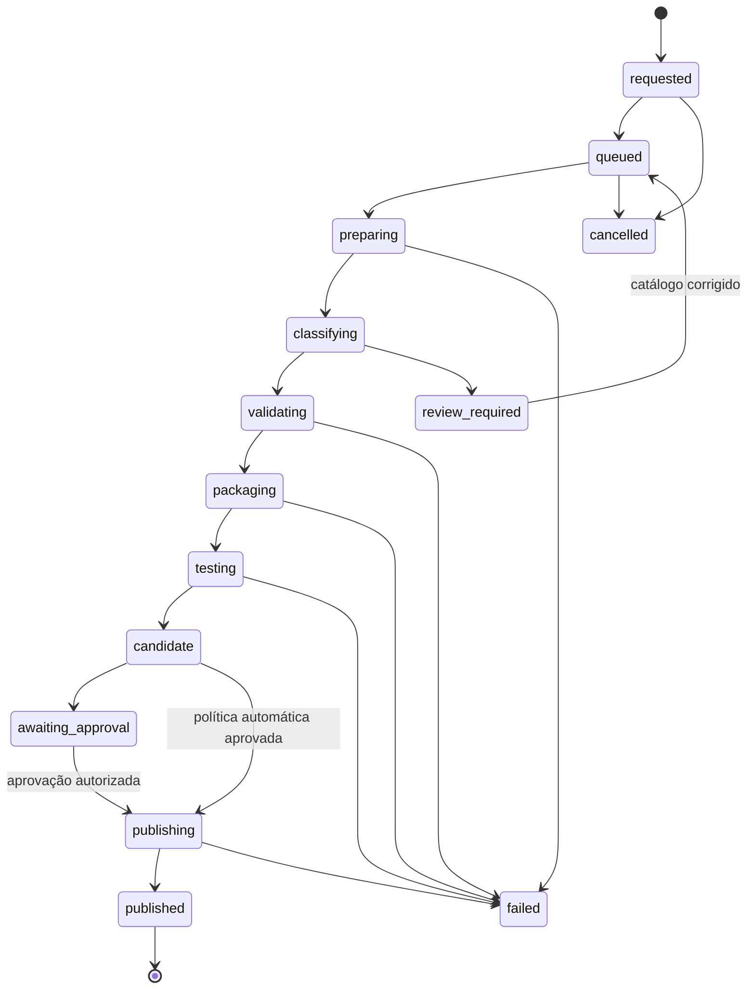

# Build do modpack

## Princípio central

O cliente nasce de um catálogo canônico revisado, não de uma cópia do servidor. O runtime vivo pode ser escaneado para detectar divergências, mas não decide sozinho o que é publicável.

No estado atual, o launcher e o servidor têm somente 11 JARs com nome exato em comum. O primeiro trabalho da futura implementação será reconciliar o catálogo, não automatizar uma incompatibilidade.

O núcleo técnico da Fase 5 está implementado em `@voidfall/modpack-release`. Ele opera somente sobre entradas explícitas e revisadas em raízes injetadas; não lê os workspaces privados nem transforma o runtime vivo em fonte canônica.

## Fonte canônica

Cada arquivo candidato precisa de:

| Campo | Regra |
| --- | --- |
| `logicalId` | identificador estável independente do nome do JAR |
| `path` | caminho relativo normalizado no cliente |
| `sha256` | hash do conteúdo aprovado |
| `side` | `client`, `server`, `both` ou `unknown` |
| `requirement` | `required` ou `optional` |
| `kind` | mod, library, config, resource-pack, shader, script ou asset |
| `source` | provedor/projeto/arquivo ou origem interna revisada |
| `licenseDecision` | permitido, proibido ou pendente |
| `dependencies` | requisitos e incompatibilidades conhecidos |
| `sanitizationPolicy` | regra aplicada antes de publicar |

`unknown` ou licença pendente bloqueiam o canal estável. A detecção automática pode sugerir valores, mas nunca transforma incerteza em aprovação.

## Estados do build



Estados terminais: `published`, `failed`, `cancelled`. `review_required` conserva evidência e não publica.

## Fluxo completo

1. Receber solicitação autenticada e idempotente.
2. Registrar solicitante, motivo, versão base e política de promoção.
3. Criar diretório temporário exclusivo fora do runtime e fora do webroot.
4. Capturar snapshot somente leitura do catálogo e dos overrides aprovados.
5. Comparar inventário do servidor, cliente anterior e catálogo.
6. Classificar arquivos por lado, obrigatoriedade e tipo.
7. Parar em qualquer decisão desconhecida exigida pela política.
8. Copiar somente arquivos explicitamente incluídos para staging.
9. Sanitizar configurações por transformações determinísticas e revisadas.
10. Rejeitar segredos, mundo, jogadores, logs, caches, `.git`, binários operacionais e caminhos locais.
11. Validar duplicatas, dependências, loader, Minecraft, integridade e estrutura.
12. Gerar lista ordenada de arquivos e SHA-256.
13. Gerar manifesto canônico e changelog calculado contra a versão anterior.
14. Assinar o manifesto com chave fora do workspace.
15. Executar testes de contrato, importação e integridade.
16. Publicar em prefixo imutável de candidato.
17. Promover o ponteiro do canal somente após os gates e a aprovação aplicável.
18. Registrar resultado, métricas e auditoria.
19. Remover o workspace temporário em bloco `finally`, inclusive em falha ou cancelamento.

## Isolamento

- um workspace exclusivo por `buildId`;
- usuário de serviço sem acesso de escrita ao servidor vivo;
- limites de CPU, memória, tempo, arquivos, bytes e descompressão;
- sem socket Docker irrestrito dentro do worker;
- rede negada por padrão e liberada apenas para provedores autorizados;
- caminhos resolvidos e verificados dentro da raiz de staging;
- symlinks, junctions e caminhos absolutos rejeitados;
- processo externo iniciado por executável fixo e argumentos separados, nunca por shell concatenado.

## Sanitização

Cada transformação deve informar entrada, saída, schema, campos removidos e teste. Exemplos de dados proibidos:

- endereço e porta privada do servidor;
- seed e coordenadas administrativas;
- senha RCON, tokens e chaves;
- UUIDs, nomes, chat e dados de jogadores;
- contas e metadados privados de launcher;
- diretórios locais e nomes de usuário do sistema;
- backups, mundo, mapas, logs e crash reports.

Não usar regex genérica como única proteção. O pipeline combina allowlist estrutural, parser do formato, scanner de segredo e inspeção do artefato final.

## Gates de publicação

- Minecraft, loader e versões correspondem ao perfil aprovado.
- Não há dois arquivos com o mesmo caminho normalizado.
- Todo JAR possui hash, origem, lado, dependências e decisão de distribuição.
- Dependências obrigatórias estão presentes e incompatibilidades ausentes.
- Nenhum arquivo é vazio, corrompido, maior que o limite ou fora da allowlist.
- Configurações compartilhadas passam pelo schema e sanitização.
- Resource packs e texturas referenciados são entregues pela mesma release.
- O diff contra a release anterior é coerente.
- O manifesto assinado referencia exatamente os bytes publicados.
- Teste de importação e verificação do launcher passa em ambiente limpo.
- Nenhum P0 do cliente/servidor aplicável permanece aberto.

## Publicação e rollback

```text
artifacts/
  releases/<version>/<buildId>/...
  manifests/<version>/<buildId>.json
  channels/stable.json
  channels/beta.json
```

O worker grava release e manifesto imutáveis. A promoção usa compare-and-swap sobre a revisão atual do canal. Rollback aponta o canal para uma release anterior já validada e gera um novo evento de auditoria; nenhum artefato antigo é reescrito.

## Retenção

- workspace temporário: sempre removido ao final;
- candidatos falhos: apenas relatório e metadados, sem árvore completa por padrão;
- releases promovidas: imutáveis conforme política de retenção;
- releases ainda referenciadas por canal ou rollback: nunca removidas;
- logs detalhados: retenção separada e redação de segredos.

## Cobertura implementada e testes operacionais futuros

- implementado: sanitização JSON/Properties, bytes exatos revisados, paths, hardlinks, hashes, tamanhos, catálogo, staging temporário e limpeza;
- implementado: mesma entrada e chave produzem o mesmo manifesto e assinatura Ed25519;
- implementado: artifacts imutáveis, conflito de release, promoção CAS e rollback de canal;
- ainda obrigatório antes da ativação: parser/container adversarial mais profundo, teste de importação em cada launcher suportado, launch e conexão com o servidor compatível;
- ainda obrigatório para produção: backend externo de objects, retenção, rotação operacional de chave e recuperação de falhas do storage escolhido.
