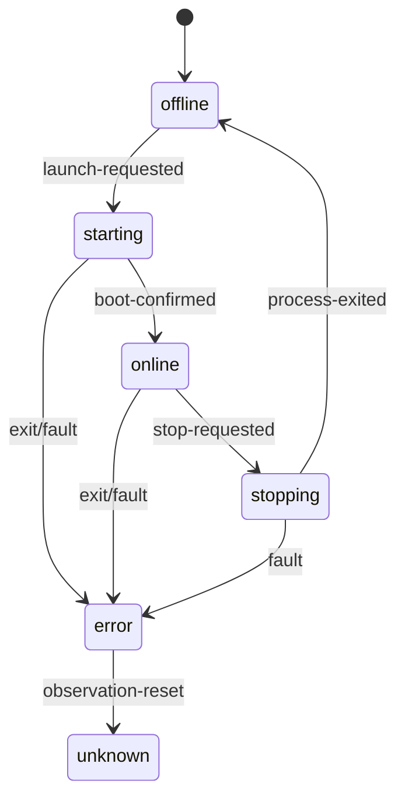

# Adaptadores de processo da Fase 3

Status: implementados em isolamento; integração operacional bloqueada.

## Objetivo do recorte

Comprovar que VoidFall consegue iniciar e parar um processo compatível com Minecraft sem aceitar shell, texto de comando ou path vindo de um usuário. O recorte termina na biblioteca `@voidfall/minecraft-process` e em seus testes.

## Componentes

| Arquivo | Responsabilidade |
| --- | --- |
| `launch-plan.ts` | constrói e valida executável, cwd, memória e argv fixo |
| `node-runtime.ts` | executa o plano com ambiente mínimo e captura limitada |
| `runtime.ts` | interfaces do processo filho, saída e exit code |
| `adapter.ts` | adapta Windows/Linux, observa boot e solicita stop gracioso |
| `state-machine.ts` | recusa transições impossíveis |

## Invariantes

- Windows e Linux possuem classes de adaptador explícitas;
- plano de outra plataforma é recusado;
- runtime real só executa plano da plataforma host;
- executable e cwd são absolutos e validados;
- máximo de 32 argumentos, sem NUL, CR ou LF;
- `shell: false`, `detached: false` e stdio fixo em pipes;
- ambiente não herda tokens, opções Node ou variáveis arbitrárias;
- stdout e stderr retêm no máximo a cauda configurada;
- stdin não aceita parâmetro: somente `stop\n` existe na interface;
- timeout não promove automaticamente para kill;
- saída inesperada durante starting/online vira `error`.

## Teste de integração

`FakeMinecraftFixture.java` emite uma linha de boot semelhante ao Minecraft, aguarda stdin e encerra somente ao receber `stop`. O teste localiza Java 17, compila a fixture antecipadamente com `javac` em `%TEMP%`/`/tmp`, observa PID/boot, envia parada graciosa e remove o diretório com retentativas seguras. A compilação antecipada evita que o primeiro uso frio do modo source-file seja confundido com falha de boot no Windows. Outro modo gera 100.000 caracteres para comprovar truncamento da saída.

O workflow `platform-ci.yml` executa o gate completo em Ubuntu e Windows com Node 24 e Temurin 17. As actions são fixadas por SHA. A [execução 30827511608](https://github.com/Myerzx/Void-Modpack/actions/runs/30827511608) aprovou os dois sistemas, incluindo os 40 testes e a auditoria de dependências de runtime.

## Fora do escopo

- descoberta ou adoção de processo já existente;
- arquivo de PID e reconciliação após crash/reboot;
- restart, concorrência e idempotência operacional;
- console genérico, RCON, force kill, backup ou restore;
- conexão com Control API, PostgreSQL, agent ou servidor privado.
