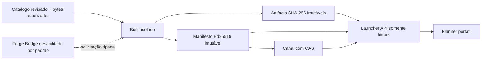

# Contrato de execução da Fase 5 — build e launcher

Status: contrato aprovado para implementação isolada em 2026-08-03; capacidades públicas e o comando no jogo permanecem bloqueados até seus gates explícitos.

## Objetivo

Concluir os sete itens da Fase 5 como uma única entrega técnica verificável: construir releases reproduzíveis a partir de entradas revisadas, aplicar sanitização determinística, assinar manifestos, armazenar bytes imutáveis, expor leitura pública segura, calcular atualização sem destruir arquivos do jogador, promover ou reverter canais por concorrência otimista e implementar o núcleo do Forge Bridge com o comando desabilitado por padrão.

Conclusão técnica em isolamento não equivale a publicar o modpack real. Os artefatos privados atuais não entram nos testes nem se tornam fonte canônica. O canal `stable` e `/atualizar-modpack` só podem ser habilitados quando o cliente-base, toda a cadeia de distribuição e os testes de importação/compatibilidade estiverem aprovados.

## Arquitetura da entrega

| Item | Proprietário | Responsabilidade | Efeito permitido nesta fase |
| --- | --- | --- | --- |
| 1. worker e staging | `@voidfall/modpack-release` e `@voidfall/build-worker` | plano fechado, workspace exclusivo, cópia explícita, hashes e limpeza | somente raízes temporárias autorizadas em testes |
| 2. sanitização e gates | `@voidfall/modpack-release` | políticas versionadas, validação estrutural, catálogo e relatório de gates | rejeitar ou produzir candidato local |
| 3. assinatura e imutabilidade | `@voidfall/modpack-release` e `@voidfall/contracts` | JSON canônico, Ed25519 e conteúdo endereçado por SHA-256 | repositório temporário injetado |
| 4. Launcher API e canais | `@voidfall/launcher-api` | leitura de canal, manifesto e artifact, sem mutação administrativa | servidor Fastify testado por injeção |
| 5. adaptador portátil | `@voidfall/launcher-protocol` | estado gerenciado e plano keep/download/replace/remove | cálculo puro, sem escolher diretório de launcher |
| 6. promoção e rollback | `@voidfall/modpack-release` | ponteiro de canal com compare-and-swap e histórico imutável | canal local de teste, nunca o real |
| 7. Forge Bridge | `integrations/forge-bridge` e contratos compartilhados | validar permissão, nonce, validade e capability antes da solicitação | núcleo Java 17 sem instalação no servidor |

O adaptador oficial da fase é o protocolo portátil VoidFall, não um produto de terceiro. CurseForge, Modrinth App, Prism Launcher e outros poderão receber exportadores próprios a partir do mesmo manifesto; nenhum deles passa a ser a fonte canônica.

## Trust boundaries



Fronteiras obrigatórias:

1. o plano de build referencia somente entradas de catálogo válidas e paths relativos sob uma raiz construída pelo operador;
2. nenhum scan do runtime, descoberta automática, rede, extração ou execução de JAR ocorre;
3. a chave privada é injetada como `KeyObject` e nunca é lida de payload, workspace, variável serializada ou manifesto;
4. a API pública possui somente `GET` e não recebe path de filesystem;
5. o planner só remove paths que pertenciam ao estado gerenciado anterior;
6. promoção e rollback alteram somente o ponteiro do canal e exigem a revisão esperada;
7. o Bridge não aceita shell, comando textual, path ou credencial administrativa.

## Plano de build fechado

O plano contém identidade da release, runtime, perfil, canal pretendido, catálogo revisado, referência relativa da fonte, política de sanitização, paths removidos e relatório dos gates externos. O serviço aceita somente arquivos declarados; uma árvore de origem nunca é copiada por varredura.

Políticas iniciais:

- `exact-reviewed-bytes-v1`: preserva bytes cujo SHA-256 já foi revisado;
- `canonical-json-object-v1`: aceita um objeto JSON, mantém apenas chaves superiores explicitamente permitidas, rejeita chaves sensíveis e serializa em ordem canônica;
- `java-properties-allowlist-v1`: aceita o subconjunto simples `chave=valor`, mantém somente chaves permitidas, rejeita duplicatas, continuações, escapes ambíguos e chaves sensíveis e serializa em ordem canônica.

Toda política declara o SHA-256 esperado da entrada. O resultado precisa corresponder ao SHA-256 e ao tamanho do catálogo. Uma transformação não pode mudar bytes silenciosamente sem que o resultado sanitizado tenha sido revisado como a entrada canônica.

## Gates

### Gates de candidato

- contratos e paths válidos;
- runtime uniforme;
- lado `client` ou `both`;
- distribuição `allowed`, com licença, evidência, revisor e instante;
- estado `reviewed`;
- dependências sem bloqueios;
- fonte e saída com hashes esperados;
- ausência de duplicata após normalização multiplataforma;
- sanitização aplicável e sem chave sensível;
- limites de arquivos e bytes respeitados.

### Gates de `stable`

Além dos gates de candidato:

- cliente-base canônico aprovado;
- cadeia completa de distribuição aprovada;
- importação em ambiente limpo aprovada;
- compatibilidade de launch e conexão aprovada;
- manifesto e documento de canal assinados por chave confiável;
- promoção autorizada com a revisão atual do canal.

Enquanto qualquer gate externo estiver aberto, o build pode produzir evidência de candidato, mas a promoção para `stable` retorna decisão bloqueada. Não existe flag de força.

## Assinatura e identidade

- identidade de artifact: `sha256:<64 hex minúsculos>`;
- payload assinado: JSON canônico UTF-8 sem o campo `signature`;
- algoritmo: Ed25519;
- `keyId`: identificador público versionado, sem material secreto;
- manifesto e canal: validados estrutural e semanticamente antes e depois da assinatura;
- artifacts, manifests e eventos de canal: gravados com criação exclusiva e nunca sobrescritos.

O repositório usa esta disposição lógica:

```text
artifacts/sha256/<primeiros-2>/<sha256>
releases/<version>/<buildId>/manifest.json
channels/<channel>/current.json
channels/<channel>/events/<revision>.json
```

## Planner portátil

O planner recebe manifesto novo e estado local gerenciado anterior. Ele produz operações ordenadas:

- `keep`: path e hash já correspondem;
- `download`: path ainda não era gerenciado;
- `replace`: path gerenciado possui hash diferente;
- `remove`: path estava gerenciado e foi removido pelo novo manifesto.

Um arquivo extra do usuário nunca aparece em `remove`. Aplicação atômica, download e rollback local pertencem ao cliente consumidor e exigirão adapter de filesystem próprio; o contrato puro permite que qualquer launcher implemente esses passos sem depender de pasta privada de outro launcher.

## Forge Bridge

O núcleo Java recebe somente uma intenção `modpack.build.request` com UUID do jogador, servidor, correlação, nonce, emissão, expiração e versão de protocolo. Antes de encaminhar, verifica:

1. protocolo suportado;
2. janela temporal curta;
3. nonce ainda não consumido;
4. permissão exata `modpack.build.request`;
5. capability operacional `modpack-build-request`;
6. gates `client-base-approved` e `distribution-chain-approved`.

O texto `/atualizar-modpack` é apenas o ponto de entrada do adapter Forge futuro. O núcleo não executa build, não promove `stable`, não abre processo e não contém fallback administrativo. Nesta fase, os dois gates externos permanecem `false`, portanto o resultado esperado é `disabled`.

## Gate de conclusão técnica

A Fase 5 pode ser marcada como tecnicamente concluída em isolamento quando:

1. este contrato e os contratos portáteis estiverem versionados;
2. build repetido com a mesma entrada gerar os mesmos artifacts e payload de manifesto;
3. falha provar limpeza do staging e preservação de releases/canais anteriores;
4. sanitizadores e paths maliciosos forem rejeitados;
5. assinatura válida, adulteração e chave errada forem testadas;
6. criação imutável, promoção CAS e rollback para release anterior forem testados;
7. Launcher API não oferecer mutação e validar tudo antes de servir;
8. planner preservar arquivos não gerenciados e ordenar operações;
9. Bridge Java 17 provar permissão, replay, expiração e capability deny-by-default;
10. gate completo local, matriz Windows/Linux, documentação, Graphify e handoff passarem.

O gate operacional continua separado e vermelho até que os P0 do cliente-base e da distribuição sejam resolvidos com evidência real. Essa distinção impede que uma suíte verde publique bytes ainda não autorizados.

## Fora de escopo

- ler ou copiar `Launcher/workspace/` e `Servidor/workspace/`;
- importar o cliente atual como catálogo canônico;
- escolher automaticamente licenças, lado, dependências ou compatibilidade;
- integrar API administrativa, painel ou object storage externo;
- instalar o Bridge no Forge real;
- habilitar `/atualizar-modpack`;
- publicar qualquer canal real;
- prometer compatibilidade com um launcher sem seu teste de importação específico.
