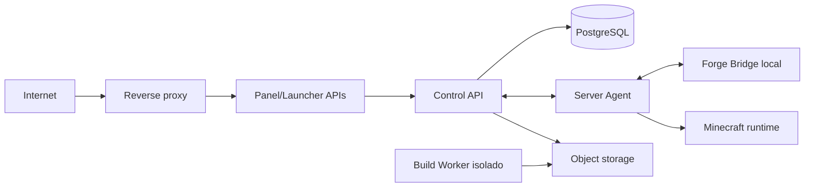

# Segurança

## Modelo de confiança

Cada seta cruza um limite autenticado e validado. Control API, agent, worker e bridge usam identidades distintas e privilégios mínimos.

## Autenticação

### Painel

- senha com Argon2id e parâmetros calibrados no ambiente;
- MFA opcional no MVP e obrigatório para Dono antes da produção pública;
- sessões opacas com token bruto apenas no cookie e hash no banco;
- expiração absoluta e por inatividade;
- revogação individual e global;
- rate limiting, atraso progressivo e bloqueio temporário;
- cookie `HttpOnly`, `Secure`, `SameSite` e rotação após login/MFA;
- CSRF em toda mutação autenticada por cookie;
- HTTPS atrás de reverse proxy configurado e headers de segurança.

### Agente

- provisionamento de uso único;
- certificado/identidade única por instância;
- mTLS, rotação e revogação;
- tokens de operação curtos e vinculados a job, recurso e ação;
- nonce, timestamp, idempotência e proteção contra replay.

### Forge Bridge

- endpoint somente em loopback ou IPC local;
- segredo/identidade exclusivo e escopo apenas para eventos do jogo;
- HMAC do envelope, nonce de uso único e janela curta;
- permissão validada no Forge antes do envio;
- sem acesso ao banco, storage ou credencial administrativa.

## Autorização

- deny by default;
- RBAC do painel separado dos grupos Minecraft;
- autorização verificada na API e novamente no agente para operações perigosas;
- `force-kill`, terminal, restore, promoção e gestão de usuários como permissões independentes;
- reautenticação/MFA para ações destrutivas críticas;
- motivo obrigatório para ban, restore, force kill, mudança de permissão e rollback.

## Execução de processos

Nenhuma rota aceita texto de shell. O agente expõe operações tipadas (`startServer`, `gracefulStop`, `sendConsoleCommand`, `createBackup`) que mapeiam para executáveis fixos e arrays de argumentos revisados.

- `shell=false` por padrão;
- working directory fixo e resolvido;
- ambiente mínimo;
- timeout e cancelamento;
- limite de saída;
- allowlist de comandos do console por permissão;
- terminal do SO fora do MVP.

A documentação oficial do Node diferencia `spawn`/`execFile` da execução por shell e mantém `shell` desabilitado por padrão.

### Recorte implementado na Fase 3

`@voidfall/minecraft-process` valida novamente o plano no adaptador e no runtime. O runtime usa executável absoluto, argv separado, `shell: false`, `detached: false`, stdio em pipes, janela oculta no Windows e um ambiente mínimo. stdout/stderr mantêm somente uma cauda com limite configurável. A única escrita disponível no handle é `requestGracefulStop()`, que envia o literal `stop\n`; não existe método de comando arbitrário ou force kill.

Os testes de integração usam `FakeMinecraftFixture.java` com Java 17 e diretório temporário do sistema. Não leem nem escrevem `Servidor/workspace/`.

## Arquivos e uploads

- raízes lógicas (`config`, `mods-staging`, `logs-export`) mapeadas pelo agente;
- canonicalização seguida de verificação de contenção;
- rejeição de path absoluto, `..`, ADS/dispositivos Windows, symlink, junction e hardlink suspeito;
- extensão, MIME, magic bytes e tamanho verificados;
- nomes gerados internamente para storage;
- upload em quarantine sem permissão de execução;
- arquivos compactados inspecionados antes de extrair;
- limites de entradas, profundidade, razão de compressão e tamanho expandido;
- nunca executar JAR enviado para descobrir metadados;
- backup automático/revisão anterior antes de substituir configuração crítica.

## Segredos

- variáveis injetadas por cofre/gerenciador do ambiente;
- nunca em Git, manifesto, job payload, log ou auditoria;
- redação centralizada por chave e padrão;
- chaves de assinatura fora do worker quando possível, acessadas por serviço de assinatura;
- rotação com `keyId`, período de sobreposição e procedimento de revogação;
- a senha RCON encontrada no runtime deve ser rotacionada antes de qualquer integração.

## Ameaças principais

| Ameaça | Controle obrigatório |
| --- | --- |
| Command injection | operações tipadas, argv separado, sem shell e allowlist |
| Path traversal/symlink escape | canonicalização, containment e handles seguros |
| ZIP bomb | limites pré/pós-extração e sandbox |
| Build contaminado | catálogo allowlist, staging isolado e scanner de segredo |
| Manifesto adulterado | assinatura Ed25519, HTTPS, hash e chave fixada |
| Replay de job | nonce, prazo, idempotência e lease |
| Agente comprometido | credencial por instância, escopo mínimo, revogação e egress limitado |
| Exposição de jogador | retenção, RBAC, redação e auditoria de leitura sensível |
| CSRF/XSS | CSRF token, CSP, cookies seguros e escaping |
| Brute force | Argon2id, rate limit, lockout e MFA |
| SSRF por URL de mod | origens aprovadas, DNS/IP policy e download worker isolado |
| Supply chain | origem, licença, hash, assinatura e revisão de dependência |

## Privacidade

- coordenadas são localização dentro do jogo, nunca localização física;
- chat, comandos, IP administrativo e coordenadas têm finalidade e retenção explícitas;
- acesso a dados sensíveis gera auditoria;
- exports aplicam minimização e autorização;
- nomes anteriores vêm somente de observação local permitida;
- UUID, não nome, identifica jogadores.

## Gates antes de produção

- resolver offline mode/whitelist/RCON do servidor;
- ameaça e teste de abuso de cada endpoint de arquivos/processo;
- teste de traversal em Windows e Linux;
- scanner de segredo no build e no CI;
- rotação e recuperação de credenciais documentadas;
- restore de banco, mundo e artifacts testado;
- dependências fixadas e auditadas;
- reverse proxy, TLS, rate limit e limites de corpo verificados;
- revisão independente do protocolo de assinatura.

## Controles validados na Fase 2

- Argon2id, sessão opaca, hash de token, expiração, revogação e CSRF;
- rate limit de login, lockout e envelope público de erro sem stack;
- RBAC deny-by-default com decisão negada registrada em auditoria;
- provisionamento de agente de uso único, identidade de transporte, Ed25519, prazo e nonce anti-replay;
- lease PostgreSQL com `SKIP LOCKED`, idempotência e worker limitado a `system.noop`;
- dashboard estático identificado como demonstração, sem controles operacionais;
- planos de processo da Fase 3 com paths absolutos, argv fixo e `shell: false`, ainda sem execução.

## Referências

- [OWASP Password Storage Cheat Sheet](https://cheatsheetseries.owasp.org/cheatsheets/Password_Storage_Cheat_Sheet.html)
- [OWASP File Upload Cheat Sheet](https://cheatsheetseries.owasp.org/cheatsheets/File_Upload_Cheat_Sheet.html)
- [Node.js child process](https://nodejs.org/api/child_process.html)
- [Next.js self-hosting](https://nextjs.org/docs/app/guides/self-hosting)
