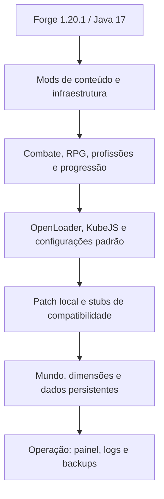

# Arquitetura do servidor

## Camadas observadas

- **Base:** Forge e dependências carregam o runtime dedicado.
- **Gameplay:** mods de combate, RPG, chefes, profissões e exploração formam o ciclo principal.
- **Dados:** OpenLoader concentra datapacks; KubeJS implementa regras e itens; `defaultconfigs` define padrões para novos mundos.
- **Compatibilidade:** um patch Forge local e três stubs suprem integrações específicas. Eles não devem ser promovidos sem revisão de autoria e licença.
- **Persistência:** o mundo contém dimensões, regiões, entidades, dados de jogadores e saved data de mods.
- **Operação:** scripts de inicialização, painel local, logs, mapas e backups pertencem ao ambiente operacional, não ao pacote distribuível.

## Arquitetura canônica do repositório

| Caminho | Responsabilidade | Publicável |
| --- | --- | --- |
| `Servidor/workspace/server-original/` | Evidência bruta imutável | Não; ignorado |
| `Servidor/catalog/` | Inventários sanitizados gerados | Sim |
| `Servidor/templates/` | Exemplos seguros, sem estado ou segredo | Sim |
| `Servidor/tools/` | Auditoria e validação reproduzíveis | Sim |
| `Servidor/pack/` | Futuro pacote dedicado canônico | Somente após os gates |
| `Servidor/source/` | Futuro código próprio com licença definida | Somente após revisão |
| `docs/servidor/` | Decisões, runbooks e evidências públicas | Sim |

## Limites de responsabilidade

O cliente e o servidor são produtos relacionados, mas têm fontes e releases independentes. Arquivos compartilhados devem nascer de uma decisão explícita de compatibilidade; copiar pastas inteiras entre os dois lados não é uma estratégia de build. Mundo, dados de jogadores e segredos são estado de implantação e nunca fonte do modpack.
